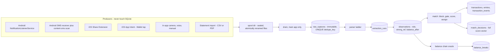
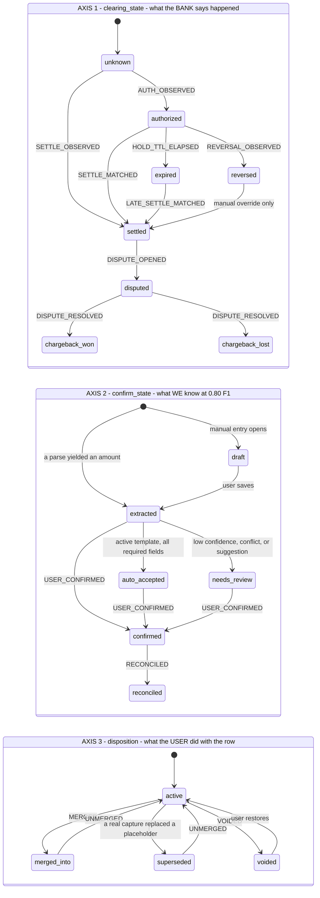
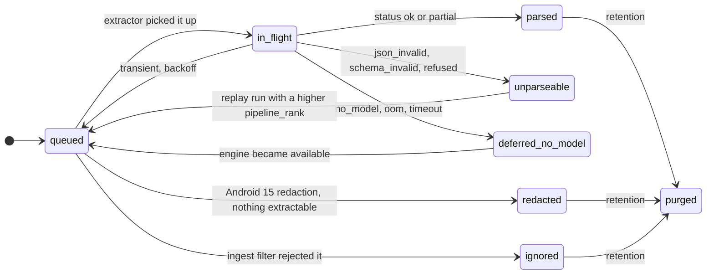

## The capture pipeline

The pipeline has **three layers that are never allowed to bleed into each other**, and the single
most important architectural statement in this section is where the boundaries fall:

| Layer | Table | What it is | What may never happen here |
| --- | --- | --- | --- |
| 1 | `raw_captures` | Immutable staging. One row per *delivery*. | No parsing, no normalization, no fuzziness. `dedupe_key` equality is the **only** thing that collapses two rows. |
| 2 | `extraction_runs` → `observations` | One row per *parse attempt*; the observation is the (capture, current extraction) pair with a role. | No overwriting. A better model produces a new run, never an edit. |
| 3 | `transactions` + `entries` + `transaction_events` | The ledger and its projection. | No capture-level concerns. The ledger never learns which channel a number came from — that lives on `observations` and `transaction_fields`. |

Every one of the three is append-only, which is what makes incremental export `WHERE id > :watermark`
and makes the event log double as the backup format (§3.6).

Conflating layers 1 and 2 is the root cause of the classic "two coffees merged into one" bug.
Exact delivery idempotency and cross-channel entity resolution are unrelated problems with
unrelated failure modes; §4.3 and §4.6 keep them apart on purpose.

---

### 4.1 The pipeline, end to end



The producers write sealed files into a spool directory and return. They cannot open the database:
on Android the notification listener has no query API to op-sqlite (its entire Kotlin surface is
`install()`, `getDylibPath()`, `moveAssetsDatabase()`), and on iOS a SQLCipher + WAL database inside
an App Group container is a deterministic `0xdead10cc` termination on every backgrounding. The same
spool is used by the in-app producers even though they *could* write directly, so that
`raw_captures` has exactly one writer and one code path on both platforms.

---

### 4.2 The transaction lifecycle

Three orthogonal axes, per §3.5. A single status enum here would be a ~30-state product where most
states are illegal, and the illegal ones are the bugs.



#### 4.2.1 Axis 1 transitions, with guards and emitted events

| From | To | Trigger | Guard | Event written |
| --- | --- | --- | --- | --- |
| `unknown` | `authorized` | auth-shaped bank message | message matched an auth lexicon, or carries an auth code with no posting date | `AUTH_OBSERVED` |
| `unknown` | `settled` | statement line, posted/"cargo aplicado" message, or any cash receipt | cash never has an auth phase | `SETTLE_OBSERVED` |
| `authorized` | `settled` | a settlement observation matched | passed §4.6 with role pair settle↔auth | `SETTLE_MATCHED` + `AMOUNT_ASSERTED` |
| `authorized` | `reversed` | explicit void / "reversa" / "cancelación" | — | `REVERSAL_OBSERVED` |
| `authorized` | `expired` | **local timer**, no bank message | `now > booked_at_utc + hold_ttl_days` | `HOLD_TTL_ELAPSED` |
| `expired` | `settled` | late settlement | expiry is **not** terminal — reopen | `LATE_SETTLE_MATCHED` + `AMOUNT_ASSERTED` |
| `settled` | `disputed` | user action | — | `DISPUTE_OPENED` |
| `disputed` | `chargeback_won` / `chargeback_lost` | resolution | won expects a linked credit transaction | `DISPUTE_RESOLVED` |
| `reversed` | `settled` | manual override only | never automatic | `USER_VALUE_SUPERSEDED` |

`expired` is load-bearing and most apps omit it. A $1 fuel pre-auth or a $200 hotel hold that never
posts pollutes the ledger forever without it — and because the reporting predicate (§3.5.2) counts
`authorized`, the phantom hold is *in the user's spend number* until the timer fires. Defaults:
`hold_ttl_days` = 3 for `fuel`, 31 for `hotel` / `car_rental` / cruise, 8 for everything else.

#### 4.2.2 Axis 2 and the `needs_review` flag are different things

`confirm_state` is a ratchet the user drives forward. `needs_review INTEGER` is an orthogonal
**flag** the system raises and lowers. A settlement arriving after the user already confirmed at a
different amount does *not* drop `confirm_state` back — it stays `confirmed`, `needs_review` flips
to 1, and `USER_VALUE_SUPERSEDED` is written so the UI can say *"settled at 27.50 — you entered
25.00."* `v_review_inbox` (§3.20) already unions on `confirm_state IN ('extracted','needs_review')
OR needs_review = 1`, which is exactly this design.

`needs_review = 1` is raised by any of: `overall_confidence < CFG.confidence.review`, a required
field null, an open `field_conflicts` row, an open `balance_breaks` row pointing here, a
`match_decisions` row with `outcome='suggested'` and no `user_response`, or
`line_items_delta_minor` outside tolerance.

`reconciled` requires an authoritative cross-check: a matched `bank_statement` observation, or a
continuous balance chain across this transaction. **On iOS the practical ceiling is `confirmed`**,
because there is no passive capture to build a chain from, and the UI must say so rather than
implying a reconciliation that never happened.

#### 4.2.3 Two conventions this section relies on

1. **Header amounts are unsigned magnitudes; `transactions.direction` carries the sign.**
   `entries.amount_minor` is signed. The §3.5 `CHECK` permits a negative header amount but the
   repository never writes one — the blocking query's shape (`direction = :dir` *and*
   `effective_amount_minor BETWEEN :a_lo AND :a_hi`) only makes sense under this convention, and
   the dedupe amount bands below all assume it.
2. **`transaction_events.seq` is allocated as `SELECT COALESCE(MAX(seq),0)+1 FROM transaction_events
   WHERE txn_id = ?` inside the same `BEGIN IMMEDIATE` as the insert.** `UNIQUE(txn_id, seq)`
   otherwise collides when a batch drain runs alongside a user edit, and the drain is the one path
   guaranteed to be writing dozens of events at once.

---

### 4.3 Layer 1 — exact delivery idempotency

`raw_captures.dedupe_key` is 64 lowercase hex, `UNIQUE`, and **must contain a timestamp assigned by
the OS or the content provider** — never the app's own receipt time, and never omitted.

| `source_channel` | `dedupe_key` = sha256 of |
| --- | --- |
| `android_notification`, `android_notification_sms` | `package ‖ sbn.getKey() ‖ sbn.getPostTime() ‖ canonical_text` |
| `android_sms` | `sender_address ‖ sms.date_ms ‖ body` |
| `ios_share`, `ios_shortcut` | `content_sha256 ‖ extension_invocation_uuid` |
| `ios_wallet_intent` | `card ‖ merchant ‖ amount_text ‖ intent_invocation_uuid` |
| `camera_receipt`, `screenshot_ocr` | `image_bytes` |
| `voice` | `audio_bytes ‖ recording_started_at` |
| `statement_import`, `file_import` | `file_sha256 ‖ line_number` |

`canonical_text` = `title ‖ "" ‖ text ‖ "" ‖ bigText ‖ "" ‖ subText`, NFC-normalized
with whitespace runs collapsed. Read every extra with `extras.getCharSequence(key)?.toString()` —
`Bundle.getString()` returns **null** for a `SpannableString`, which is what most posters actually
put there, and a null field silently changes the key.

Why `getPostTime()` and not `System.currentTimeMillis()`: `postTime` is assigned once at post and is
preserved when the same notification is re-delivered through `getActiveNotifications()` on rebind,
reboot or permission re-grant, so re-delivery is byte-identical. Two genuine coffee purchases three
minutes apart carry different `postTime`s and therefore different keys. **Omitting `postTime` merges
the two coffees; using the app's own clock duplicates every re-delivery.** Both failures are silent.

On conflict the drain does **not** drop the row:

```sql
UPDATE raw_captures SET seen_count = seen_count + 1, last_seen_at = :now WHERE dedupe_key = :k;
```

so re-delivery storms are observable rather than invisible.

**iOS is deliberately not idempotent across user actions.** A user who shares the same SMS twice
produces two captures, because on iOS the *user* is the delivery mechanism. Suppress it with a UI
prompt keyed on `content_hash` alone ("you already imported this"), never silently.

#### 4.3.1 `transactions.dedupe_hash` — the one place a merge is a database constraint

§3.5 declares `dedupe_hash TEXT` under `ux_txn_dedupe` (`UNIQUE … WHERE dedupe_hash IS NOT NULL AND
deleted_at IS NULL AND disposition='active'`) but does not define it. It is defined here, and
narrowly, because a `UNIQUE` index is an *unconditional* collapse with no scoring and no review:

```text
dedupe_hash = sha256_hex( direction ‖ '|' ‖ account_key ‖ '|' ‖ ref_class ‖ '|' ‖ normalize(strong_ref) )

  account_key = account_id, else 'last4:' || card_last4
  ref_class   ∈ { 'arn', 'rrn', 'cfdi', 'statement_line' }

dedupe_hash is NULL — and the index therefore does not apply — unless BOTH:
  (a) the observation carries a strong_ref of a GLOBALLY UNIQUE class, and
  (b) account identity is known (account_id or card_last4).
```

A bare 6-digit **auth code is excluded on purpose**: auth codes recycle, they are unique only per
(card, merchant, day), and a hash collision under a `UNIQUE` index would delete a purchase with no
review step and no cloud copy to recover from. Auth codes are handled by gate **G3** in the scored
path instead, where a mismatch blocks a merge but a match only *raises a score*.

The write path is **SELECT-by-hash-then-attach**, never INSERT-and-catch: a caught constraint
violation gives you no transaction id to attach the observation to, and swallowing
`SQLITE_CONSTRAINT` inside a `BEGIN` is exactly the pattern §3.19 warns about.

This is what makes "v1 auto-merges only on an exact strong-identifier match" a property of the
database rather than a policy in application code.

---

### 4.4 Staging and the drain

#### 4.4.1 The spool record

One file per capture, written to `spool/tmp/<uuidv7>.part` and `rename()`d into `spool/inbox/`
(atomic on APFS, ext4 and f2fs). Media first, **manifest last** — the manifest's arrival is the
commit marker, so a producer killed mid-write leaves an orphan media file that the sweeper deletes
after a 24 h grace period, never a half-committed capture.

```text
spool record = [ version:u8 ][ len:u32 ][ libsodium sealed_box( plaintext ) ]
plaintext    = { manifest_json, blake3(manifest_json) }
```

The sealed box uses an X25519 **public** key baked into the producer; the private key lives in the
credential-protected keystore. The capture path therefore holds no secret it could leak and needs
no key that is unavailable before first unlock. A file that fails to decrypt or fails its BLAKE3
check moves to `spool/quarantine/` and is **retained forever** (it is tiny, and the private key may
be recoverable even when the file currently is not) with a count surfaced in diagnostics — dropping
it silently is the one behaviour the sole-system-of-record constraint forbids.

Manifest fields map 1:1 onto `raw_captures` columns: `source_channel`, `source_app`, `source_ref`,
`spooled_at`, `delivered_at`, `event_at_hint`, `tz`, `utc_offset_min`, `device_locale`,
`device_region`, `payload_kind`, `payload_text`, `payload_meta_json`, `notification_template`,
`redaction_suspected`, `dedupe_key`, `content_hash`, media filename + sha256 + bytes,
`app_version_code`, `os_build`, and the `training_opt_in` consent **snapshot**.

The inbox is capped by both item count and total bytes (`CFG.spool.maxItems`,
`CFG.spool.maxBytes`). At the cap the Share Extension shows *"Money Manager has N unprocessed
items — open the app"* rather than accepting more, because an unbounded queue on iOS (where
background extraction is CPU-only, GPU access being unavailable on iPhone) drains slower than a
determined user can fill it.

#### 4.4.2 The drain loop

Runs on: app foreground, `ACTION_USER_UNLOCKED` (Android), a `DispatchSource` FD watch on the
inbox (iOS), the start of any background task, and `BGContinuedProcessingTask` when the user
explicitly asks to process a backlog.

```ts
async function drain(): Promise<void> {
  for (const file of sortByName(listDir('spool/inbox'))) {       // uuidv7 name ⇒ arrival order
    let m: Manifest;
    try { m = openSealed(file); } catch { moveTo('spool/quarantine', file); continue; }

    // Idempotent by construction: the UNIQUE index on dedupe_key is the whole mechanism.
    const existing = db.get(`SELECT id FROM raw_captures WHERE dedupe_key = ?`, m.dedupe_key);
    if (existing) {
      db.run(`UPDATE raw_captures SET seen_count = seen_count + 1, last_seen_at = ? WHERE id = ?`,
             now(), existing.id);
    } else {
      db.tx(() => {
        if (m.media) insertMediaAsset(m);        // downscale HERE, never in the extension
        insertRawCapture(m, { process_state: 'queued', received_at: now() });
      });
    }
    moveTo('spool/processed', file);             // NSFileCoordinator-wrapped on iOS
  }
  await extractQueued();                          // separate, interruptible, resumable stage
}
```

Downscaling happens in the drain, not the producer: a 12 MP HEIC is 2–4 MB, and an iOS Share
Extension dies at roughly 120 MB resident (an entitlement does **not** raise it), which a single
`UIImage` decode of a portrait photo can reach on its own. The extension copies bytes with
`loadFileRepresentation` + `copyItem`; the main app resizes to 1600 px long edge at JPEG q0.7
(~200–350 KB, still fully adequate for OCR re-runs and human review).

#### 4.4.3 `raw_captures.process_state` and the retry ladder



Backoff on transient failure: **1 m → 5 m → 30 m → 6 h → 24 h**, then park at
`deferred_no_model`. Nothing is ever discarded. `deferred_no_model` is a normal state, not an error:
the model may not be downloaded on first run, may have been deleted by the user to free space, or
may have OOMed on a 4 GB device.

`unparseable`, `redacted` and `deferred_no_model` captures **still appear in `v_review_inbox`** as
raw cards. Silence about a bank alert we could not read is the failure mode the whole design exists
to prevent — the UI says *"3 alerts from BBVA we couldn't read"*, not nothing.

The drain must be **incremental and interruptible**. Forty queued notifications after a weekend must
not block the ledger from rendering: `raw_captures` rows land first and in bulk, the extraction
stage runs per-capture and commits per-capture, and the timeline shows what has been parsed so far
with a "N still processing" affordance.

---

### 4.5 Observations: role, authority, and the `value_source_rank` contract

An observation is `(raw_capture, its current extraction)` with a derived role. Role is assigned by
the classifier, not by the channel:

| `observations.role` | Assigned when | `evidence_authority` | `authority_rank` |
| --- | --- | --- | --- |
| `bank_statement` | `source_channel = 'statement_import'` | `statement_line` | **60** |
| `bank_settle` | posted/settled lexicon hit, or a posting date is present | `bank_settlement` | **50** |
| `bank_auth` | auth lexicon hit, or an auth code with no posting date | `bank_auth` | **40** |
| `wallet_tap` | `source_channel = 'ios_wallet_intent'` | `bank_auth` | **40** |
| `merchant_receipt` | receipt image / OCR / share of a merchant email | `merchant_receipt` | **30** |
| `user_manual` | `manual_text`, in-app entry, or any user edit | `user_assertion` | **20** |
| `voice` | `source_channel = 'voice'` | `user_assertion` | **20** |
| *(no observation)* | `kind = 'inferred_gap'` from the balance oracle | `inference` | **10** |

§3.11.4 constrains `authority_rank` to exactly `(60,50,40,30,20,10)` but never says which role maps
where. This table is that mapping, and it is a cross-section contract.

#### 4.5.1 `value_source_rank` must encode channel precedence, not just pipeline quality

**This is load-bearing and §3.11.4 leaves it undefined.** The equal-authority branch of the
replacement rule resolves on `value_source_rank`, then `observed_at`. Consider the ordinary Mexican
case: a bank SMS arrives, the messaging app posts a notification relaying it, and the provider row
is picked up by the periodic `content://sms` scan a few minutes later. Both are `bank_auth`
(authority 40) but on different channels, so `ux_observations_slot` correctly admits both. The
notification body is **truncated** and is subject to Android 15 redaction; the provider row is full
text and is never redacted. If `value_source_rank` only tracked pipeline quality, the truncated
notification could win on `observed_at` and silently degrade a correct parse.

```text
value_source_rank = channel_precedence * 1000 + pipeline_rank

channel_precedence:
  90  statement_import, file_import
  80  android_sms                        -- full text, never redacted, has a sender address
  70  ios_wallet_intent                  -- device-authoritative for the tap
  60  android_notification_sms           -- messaging app relaying a bank SMS
  50  android_notification               -- may be truncated or redacted
  40  camera_receipt, ios_share
  30  screenshot_ocr
  20  voice
  10  manual_text          -- low CHANNEL precedence; user edits win via pinned_by_user, not here
```

Source precedence `sms > notification_sms > notification` is the direct consequence, and it is the
right one: the provider row has full untruncated text, a sender address, and immunity from the
Android 15 sensitive-notification classifier.

---

### 4.6 Layer 2 — the dedupe algorithm

Cross-channel entity resolution. Runs **only between different `source_channel` values**, once per
observation, over `observations` — never over `raw_captures`.

#### 4.6.0 Matcher idempotency

Nothing in the schema stops the matcher re-evaluating an observation it already decided. During a
replay run, or a drain of forty queued captures, that produces duplicate `suggested` rows and floods
the review inbox.

```text
Evaluate observation O iff:
    no match_decisions row exists for O at the current CFG.algoVersion
  OR (algo_version bumped AND the prior row has user_response IS NULL)

A decision the user has responded to is NEVER re-asked. Rejections additionally write a
match_vetoes row keyed on CAPTURE ids, which gate G7 honours forever, including during replay.
```

#### 4.6.1 Blocking

The indexed pre-filter (`ix_txn_block` exists for exactly this shape, §3.5):

```sql
SELECT t.* FROM transactions t
 WHERE t.deleted_at IS NULL AND t.disposition = 'active'
   AND t.direction = :dir
   AND (t.currency_code = :cur OR t.reporting_currency_code = :cur)
   AND t.booked_at_utc BETWEEN :t_lo AND :t_hi
   AND t.effective_amount_minor BETWEEN :a_lo AND :a_hi
   AND (t.account_id IS NULL OR :acct IS NULL OR t.account_id = :acct)
 LIMIT 200;
```

Everything fuzzy runs in JS over those ≤200 rows. No SQL-level fuzzy matching, no FTS in the match
path, no trigram extension.

#### 4.6.2 Windows and amount bands, per role pair

`:t_lo`/`:t_hi` and `:a_lo`/`:a_hi` come from this table, keyed on (incoming role, candidate role).
All windows are relative to the candidate's `event_at_utc`, which is the notification `postTime` /
`sms.date` / receipt printed time / auth time — **never** `received_at`, and never a posting date.

| Incoming | Candidate | Time window | Amount band | τ (`s_time`) |
| --- | --- | --- | --- | --- |
| `bank_auth` | `bank_auth` (other channel) | −10 min … +10 min | exact | 120 s |
| `bank_settle` | `bank_settle` (other channel) | −10 min … +10 min | exact | 120 s |
| `bank_settle` | `bank_auth` | −1 d … **+14 d** | class-dependent, below | 3 d |
| `merchant_receipt` | `bank_auth` / `bank_settle` | **−15 min … +120 min** | `[x, x × 1.25]` or exact | 1800 s |
| `wallet_tap` | `bank_auth` / `bank_settle` / `merchant_receipt` | −5 min … +120 min | `[x, x × 1.25]` or exact | 1800 s |
| `bank_statement` | any | −5 d … +5 d | exact | 5 d |
| `user_manual` | any | −3 d … +3 d | ±2 % or ±1 minor unit | 1 d |
| `voice` | any | −24 h … +1 h | ±5 % | 4 h |

The 14-day settlement window is the observed pending→posted range (1–5 business days typical, up to
14 in rare cases). Receipt −15 min absorbs thermal-register clock drift; +120 min absorbs a
restaurant's end-of-night batch close.

Class-dependent settle↔auth band, driven by `merchants.merchant_class`:

```text
TIP_CLASSES     = { restaurant, bar, taxi, salon }
                  band = [auth × 1.00, auth × 1.25]
PREAUTH_CLASSES = { fuel, hotel, car_rental, ev_charging }
                  band = UNBOUNDED.  A $1 fuel auth settling at $58 is normal, so the auth
                  amount carries no information: w_amount := 0 and renormalize, AND require
                  s_merchant ≥ 0.90 AND same account before any auto decision.
otherwise         band = [auth × 0.98, auth × 1.02] ∪ {exact}
```

The 1.25 ceiling is not arbitrary: Mastercard allows a 20 % tip tolerance and Visa allows 15 %
authorization-to-clearing plus gratuity up to 20 % of the base amount. Beyond ~1.25 the pair is a
**conflict**, not a match.

#### 4.6.3 The gates

Any gate firing discards the candidate. The names are exactly the `match_decisions.blocked_by`
enum values from §3.12.

```ts
function gate(o: Observation, c: Candidate): GateName | null {
  if (!currencyCompatible(o, c))                    return 'G1_currency';
  if (o.direction !== c.direction)                  return 'G2_direction';   // refunds: separate pass
  if (o.strongRef && c.strongRef &&
      norm(o.strongRef) !== norm(c.strongRef))      return 'G3_strong_ref';
  if (o.accountKey && c.accountKey &&
      o.accountKey !== c.accountKey)                return 'G4_account';
  if (sameChannelAndRole(o, c))                     return 'G5_same_channel';
  if (slotOccupied(c.txnId, o.sourceChannel, o.role)) return 'G6_slot_occupied';
  if (vetoExists(o.rawCaptureId, c.captureIds))     return 'G7_veto';
  if (c.confirmState === 'reconciled' &&
      o.role !== 'bank_statement')                  return 'G8_reconciled';
  if (violatesConservation(o, c))                   return 'G9_conservation';
  return null;
}
```

`currencyCompatible` is true when the codes match, or when both sides carry an original-currency
amount and an implied rate within `CFG.fx.impliedRateBand` (±3 %) of the reference rate for that
date from `fx_rates`.

**G8 downgrades, it does not reject.** A receipt shared three days after a statement import would
otherwise silently become a second transaction. G8 forces `outcome = 'suggested'` — never `'new'` —
so the user can attach it by hand and the reconciled row keeps its authority.

G6 is enforced by the database (`ux_observations_slot`), not by this function; the check here exists
so the matcher produces a *reason* instead of a constraint violation.

G9, the conservation invariant, per (account, local date):

```text
count(active transactions) ≥ count(distinct bank_auth observations)
                             − count(reversals) − count(expiries)
```

A merge that would violate it is rejected outright. It is a cheap global guard against a scoring
regression silently eating purchases, and the startup sweep re-runs it as check I5 (§3.21).

#### 4.6.4 Scoring

Weights sum to 1.0 and are **renormalized** whenever a component is dropped.

```ts
const W = { amount: 0.30, time: 0.20, merchant: 0.25, account: 0.15, ref: 0.10 };

s_amount:
  exact                                     → 1.00
  |Δ| ≤ 1 minor unit                        → 0.95
  TIP settle/auth, r = settle/auth ∈ [1,1.25]
                                            → 1 − 0.6 · (r − 1) / 0.25
  PREAUTH settle/auth                       → drop the component (w := 0), renormalize
  cross-currency, both original amounts known
                                            → exact comparison in the original currency
  cross-currency, only converted known
                                            → clamp(1 − |implied/ref − 1| / 0.03, 0, 1)
  otherwise                                 → 0

s_time     = exp(−|Δt| / τ)                 // τ from the role-pair table above
s_merchant = 1.0 if both resolve to the same merchants.id via merchant_patterns
             else max(tokenSetJaccard, trigramDice) over normalized descriptors
             else drop the component if either side has no descriptor at all
s_account  = 1.0 same account_id or same card_last4;  0.5 if exactly one is unknown
s_ref      = 1.0 if strong refs match exactly;  0 if neither side has one
                                              // differing refs already died at G3

score = Σ wᵢ · sᵢ
      + 0.25  if a strong reference matched          (capped at 1.0)
      − 0.20  if density ≥ 2
```

Descriptor normalization strips acquirer noise before comparison — leading `SQ *`, `SUMUP *`,
`PAYPAL *`, `IZ *`, `MP*`, trailing city/state/store-number tokens, embedded dates, repeated
whitespace. It is **one versioned function**; changing it invalidates every stored
`merchant_patterns.normalized` value, so the version is recorded and a change triggers a
recomputation pass.

#### 4.6.5 Decision, and assignment rather than pairwise

```text
AUTO_MERGE   score ≥ 0.88  AND  (best − second_best) ≥ 0.12  AND  density < 2
SUGGEST      0.55 ≤ score < 0.88,  or ≥ 0.88 with insufficient margin,  or G8 fired
NEW          otherwise
```

**Density escalation.** `density` = the number of near-identical candidates in the block. At
density ≥ 2, auto-merge additionally requires a matching strong identifier *or* margin ≥ 0.25;
otherwise the whole cluster goes to review as a *group* question — *"two charges of 4.50 at Blue
Bottle between 09:12 and 09:15, and two receipts — is this two purchases or one?"* Ambiguity **is**
the two-coffees case, and asking is the correct behaviour.

**Batches are a bipartite assignment with capacity 1 on both sides, never independent pairwise
decisions.** Independent decisions are precisely what merge two receipts and two SMS into one
transaction.

```ts
function assignBatch(obs: Observation[]): Decision[] {
  const pairs = obs.flatMap(o => block(o)
      .filter(c => gate(o, c) === null)
      .map(c => ({ o, c, ...score(o, c) })))
    .sort((a, b) => b.score - a.score);

  const usedObs = new Set<string>(), usedCand = new Set<string>();
  const out: Decision[] = [];
  for (const p of pairs) {
    if (usedObs.has(p.o.id) || usedCand.has(p.c.txnId)) continue;
    const d = decide(p);                       // AUTO_MERGE | SUGGEST | NEW
    if (d === 'AUTO_MERGE') { usedObs.add(p.o.id); usedCand.add(p.c.txnId); }
    out.push(record(p, d));                    // always writes a match_decisions row
  }
  for (const o of obs) if (!usedObs.has(o.id)) out.push(recordNew(o));
  return out;
}
```

**One assignment pass per import, not per line, and chunk-transactional** — a statement import that
is killed halfway must not leave half a statement attached to the ledger with the other half
unrepresented. Chunk size is `CFG.match.batchChunk` lines, each chunk one `BEGIN IMMEDIATE`, with a
resumable watermark on the import row.

Every evaluation writes a `match_decisions` row with its full score vector, `algo_version`, and
`blocked_by` when gated. That table is three things at once: the audit trail when a user asks *"why
did you merge these"*, the labelled local dataset for tuning the weights with zero telemetry, and
the source of vetoes.

#### 4.6.6 The product decision, stated so it cannot be quietly reversed

**Bias to under-merge.** A leftover duplicate is *visible* — the user sees two coffees and taps
merge — and recoverable. A wrong merge is *invisible*: a purchase simply disappears, spend is
understated, the balance chain quietly breaks, and with no cloud backup and the on-device DB as
sole system of record it is unrecoverable in practice. Every threshold above is set on the
conservative side and every tie goes to *"two transactions plus a suggestion"*.

This extends to the UI: the review inbox reads *"possible duplicate"* with a merge button. It never
auto-collapses with an undo toast.

---

### 4.7 Scenario A — one purchase, four channels

MXN 480.00 at a restaurant. The bank posts a push, sends an SMS, the user photographs the receipt,
and three days later imports the statement.

| # | Arrival | `source_channel` | `role` | Slot | Outcome |
| --- | --- | --- | --- | --- | --- |
| 1 | 20:14:03 | `android_notification` | `bank_auth` | free | **NEW** → txn T, `clearing_state='authorized'`, `authorized_amount_minor = 48000` |
| 2 | 20:14:41 | `android_sms` | `bank_auth` | free (different channel) | scored vs T |
| 3 | 21:02 | `camera_receipt` | `merchant_receipt` | free | scored vs T |
| 4 | +3 d | `statement_import` | `bank_statement` | free | scored vs T |

**Row 2.** G5 does not fire — same role, *different* channel, which is exactly the case Layer 2
exists for. Window −10 min…+10 min: Δt = 38 s ⇒ `s_time = exp(−38/120) = 0.73`. Amount exact ⇒ 1.0.
Same `card_last4` ⇒ `s_account = 1.0`. Both carry the same 6-digit auth code ⇒ `s_ref = 1.0` **and**
the +0.25 strong-reference adjustment. Merchant descriptors normalize to the same
`merchant_patterns` row ⇒ 1.0. Score = 0.30 + 0.146 + 0.25 + 0.15 + 0.10 = 0.946, +0.25 → capped
1.0. Density 1, margin unbounded ⇒ **AUTO_MERGE**. The SMS observation attaches to T in slot
`(android_sms, bank_auth)`.

Note the auth code did **not** produce a `dedupe_hash` (§4.3.1) — it is a recycling 6-digit code, so
it raised the score and satisfied G3 rather than short-circuiting the whole path.

Now `transaction_fields` has two `bank_auth` candidates at authority 40. The equal-authority branch
resolves on `value_source_rank`: `android_sms` = 80·1000 + rank vs `android_notification` =
50·1000 + rank. **The SMS wins regardless of arrival order or pipeline rank**, which is the point of
§4.5.1 — the notification body was truncated at "Compra por MXN 480.00 en LA DOC…" and the SMS
carries the full merchant string and the running balance.

**Row 3.** Receipt vs auth, window −15 min…+120 min, Δt = 48 min ⇒ `s_time = exp(−2880/1800) =
0.20`. The receipt total is 480.00 exactly ⇒ `s_amount = 1.0`. No strong ref on the receipt ⇒
`s_ref` component dropped and weights renormalized. `s_merchant = 1.0`, `s_account = 0.5` (the
receipt knows no account). Renormalized score ≈ 0.83 ⇒ **SUGGEST**, not auto. Correct: at 0.80 F1
a receipt total is the least reliable number in the pipeline, and the user confirms with one tap.
On confirm, the receipt's `line_items` attach to T and `line_items_delta_minor` is computed.

**Row 4.** Statement line, authority 60, exact amount, ±5 d window. It carries a globally unique
`external_id`, so **`dedupe_hash` is set** — but T's `dedupe_hash` is NULL (no globally unique ref
until now), so there is no constraint short-circuit and the scored path runs: exact amount, exact
account, `s_time = exp(−3d/5d) = 0.55` ⇒ score ≈ 0.90 with a clear margin ⇒ **AUTO_MERGE**. On
attach: `clearing_state → settled`, `confirm_state → reconciled`, `dedupe_hash` written onto T, and
`RECONCILED` + `SETTLE_MATCHED` events.

**Final shape: one transaction, four observations in four distinct slots, four rows in
`match_decisions`, zero rows deleted.** Every input is still individually inspectable, which is what
makes unmerge possible and what feeds the FunctionGemma harvest.

---

### 4.8 Scenario B — two identical coffees, three minutes apart

Two MXN 45.00 purchases at the same café, 09:12 and 09:15. Each produces a push and an SMS: four
observations, and the correct answer is **two** transactions.

Five **structural** rules do this. None of them is a tolerance:

1. **G5, the same-channel rule.** The two pushes are both `(android_notification, bank_auth)`. They
   are never fuzzy-compared — only `dedupe_key` equality could collapse them, and their `postTime`s
   differ by 180 000 ms. A bank emits exactly one auth message per authorization, so two messages
   from one channel are two authorizations. **This rule alone removes most of the false-merge
   surface**, and it is why the primary idempotency key must contain `postTime`.
2. **G6, slot capacity.** Once push #1 occupies `(android_notification, bank_auth)` on T₁, push #2
   cannot occupy it. Enforced by `ux_observations_slot`, in the database, not in this code.
3. **G3, the strong-identifier gate.** Two coffees have different auth codes. If both sides carry
   one and they differ, merging is forbidden *regardless of score* — this is the definitive
   separator whenever the bank includes an auth code.
4. **Density escalation.** With two near-identical candidates in the block, auto-merge for SMS #2
   would require a matching strong identifier or margin ≥ 0.25. Neither holds, so the cluster goes
   to review as one group question rather than four independent yes/nos.
5. **G9, conservation.** `count(active transactions) ≥ count(distinct bank_auth observations) −
   reversals − expiries` on that account-day. Any merge that would take the count from 2 to 1 while
   two distinct auth observations exist is rejected.

The scored path then does the right thing anyway: SMS #1 vs T₁ scores 1.0 (exact time, exact ref)
while SMS #1 vs T₂ hits G3 on the auth code. If the bank omits auth codes entirely, Δt = 180 s
against τ = 120 s gives `s_time = exp(−1.5) = 0.22`, dropping the cross-pair score to ≈ 0.71 —
**SUGGEST**, never auto — and the assignment pass takes the higher-scoring pairing first, so SMS #1
lands on T₁ and SMS #2 on T₂ by capacity.

If the user answers *"these are two different coffees"*, a `match_vetoes` row is written **keyed on
capture ids**, not transaction ids, because transaction ids change under merge and unmerge while
capture ids never do. G7 honours it forever, including during replay: a smarter model is not
allowed to overrule the user.

---

### 4.9 Auth hold → settlement

The settlement amount is recorded as an **additional asserted amount**, never as an overwrite. The
original survives in three independent places: `raw_captures.payload_text` (immutable),
`transactions.authorized_amount_minor`, and the `AMOUNT_ASSERTED` event payload
(`{"amount_minor":2750,"prev":2500}`).

Applying a settlement is a **ledger mutation**, so it follows the seal protocol from §3.7.1:

```ts
db.tx('BEGIN IMMEDIATE', () => {
  db.run(`DELETE FROM transaction_seals WHERE txn_id = ?`, T);        // unseal

  // clearing_state MUST flip in the SAME statement: CHECK (clearing_state <> 'authorized'
  // OR settled_amount_minor IS NULL) rejects the two-step version.
  db.run(`UPDATE transactions
             SET settled_amount_minor = ?, clearing_state = 'settled',
                 tip_minor = ?, posted_at_utc = ?, posted_local_date = ?,
                 updated_at = ?, hlc = ?
           WHERE id = ?`, …);                                          // dirty columns only

  rewriteLegs(T);                       // entries now carry the settled amount
  db.run(`INSERT INTO transaction_seals (txn_id, sealed_at, leg_count) VALUES (?,?,?)`, …);
  appendEvents(T, ['SETTLE_MATCHED', 'AMOUNT_ASSERTED']);
});
```

`effective_amount_minor` (STORED generated, `COALESCE(settled, authorized, amount)`) and
`adjustment_minor` (STORED, `settled − authorized`) update themselves. `tip_minor` is set only when
`adjustment_minor > 0` **and** `merchant_class ∈ TIP_CLASSES`; the UI renders *"MXN 25.00 authorized
→ 27.50 settled (tip 2.50)"*.

`trg_budget_stale_on_amount_change` fires and marks the covering `budget_periods` rows stale — that
coupling is what stops a budget silently disagreeing with the transaction list it is summing.

Three amount outcomes, three behaviours:

| Ratio `settled/authorized` | `merchant_class` | Behaviour |
| --- | --- | --- |
| 1.00 | any | plain settle |
| 1.00 … 1.25 | TIP class | settle + `tip_minor` |
| anything | PREAUTH class | settle; the auth amount is discarded as uninformative |
| > 1.25 | non-PREAUTH | **`field_conflicts` row on `amount`**, `needs_review = 1`. Almost always a decimal-separator misparse (27.50 vs 275.00), and applying precedence silently is how a 1000× error becomes permanent |

If no settlement ever arrives, the local timer fires: `HOLD_TTL_ELAPSED`, `clearing_state → expired`,
and the row leaves the reporting predicate. It is **not terminal** — a late settlement takes
`expired → settled` via `LATE_SETTLE_MATCHED`, because holds that expire and then post days later
are real.

---

### 4.10 Reversals, refunds and disputes

**The whole rule, and getting it backwards is a two-directional data bug:**

> A **reversal before settlement** is a *state change on the same transaction*. A **refund after
> settlement** is a *separate, linked transaction*.

**Reversal** (auth voided, hold expired, merchant cancelled before capture): no money ever moved.
`clearing_state → reversed` (or `expired`), same row, `REVERSAL_OBSERVED`. Booking a counter-
transaction here would create phantom income for money that never left the account and would double
the transaction count on that account — which then breaks G9 and the balance chain.

**Refund** (money returned after settlement): a real economic event with its own date, arriving as
its own bank message weeks later, frequently in a different budget period. A **new** transaction,
`kind='refund'`, `direction='credit'`, plus a `transaction_links` row `kind='REFUND_OF'`. Mutating
the original would silently rewrite a closed month's totals.

Partial refunds are N:1 by construction — several `REFUND_OF` links, each with its own
`amount_minor`. `v_txn_net` derives the net; sweep check I8 flags `net < 0`, which almost always
means the refund was linked to the wrong purchase.

Refund matching is a **separate pass** with different parameters, because the direction gate is
inverted and time carries almost no signal:

```text
G2 relaxed (direction is inverted by definition)
window        −1 d … +120 d,  τ = 21 d
weights       amount 0.35, merchant 0.40, time 0.10, account 0.15   (ref folded into amount)
AUTO_LINK     score ≥ 0.90 AND (exact amount match OR exact strong-ref match)
otherwise     SUGGEST
```

An unlinked credit stays a plain income row — visible, if slightly wrong — rather than being
force-attached to a purchase.

**Cross-currency refunds** re-convert at the refund date's rate, so the user is up or down purely on
FX. The refund transaction carries its own `reporting_rate_id` for its own date; the difference
lands on `sys_fx_conversion` through the ledger legs, exactly as it does for any cross-currency
transaction, and is visible as an FX position rather than as a mysterious few cents.

**Disputes:** `clearing_state → disputed` on the original. Reporting **still counts** disputed
amounts as spend (per §3.5.2) because the money is genuinely out. On resolution, a
`CHARGEBACK_CREDIT_FOR`-linked credit transaction is expected; `chargeback_won` without an arriving
credit within 60 days raises `needs_review`.

---

### 4.11 Transfers between the user's own accounts

**One model, chosen explicitly: transfers COLLAPSE.** One transaction with a `source` leg and a
`destination` leg, per the four-leg cross-currency worked example in §3.7.2. Net worth is
`SUM(entries.amount_minor)` over asset and liability accounts and a transfer contributes **zero
automatically** — there is no `WHERE kind <> 'transfer'` anywhere in the codebase, which is the
entire point. A report-time exclusion filter is something a future author will forget to apply on
one screen, and the user then sees their savings sweep counted as a €500 spending spike.

`transaction_links.kind = 'TRANSFER_COUNTERPART'` exists but is **not** an alternative two-row
model. On collapse the loser gets `disposition = 'merged_into'` + `merged_into_id`, and a
`TRANSFER_COUNTERPART` link row is written **purely as an audit pointer** so the relationship stays
queryable after the collapse. Nothing reads it as ledger truth.

Detection runs after a transaction reaches `extracted`:

```text
candidates: active transactions U where
    U.account_id ≠ T.account_id, both accounts user-owned
    sign(U) = −sign(T)                       (opposite direction)
    |Δt| ≤ 5 days
    same currency AND |amount| equal
      OR cross-currency AND implied rate within ±3 % of the reference rate for that date

score = 0.35·s_amount + 0.25·s_time + 0.20·s_descriptor + 0.20·s_pair_prior

  s_descriptor : transfer-lexicon hit — TRANSFER, TRASPASO, SPEI, PIX, ZELLE, BIZUM, SEPA, P2P,
                 PAGO TARJETA, PAGO DE TARJETA, RETIRO, CAJERO, ATM, "payment thank you" —
                 or the counterparty account's last4 / nickname / the user's own name appears
  s_pair_prior : Laplace-smoothed frequency with which this (account_a, account_b) pair has
                 previously been CONFIRMED as a transfer. Makes a recurring savings sweep
                 self-teaching after two or three confirmations.

auto-collapse at ≥ 0.85 and unique; otherwise SUGGEST
```

Three cases with their own rules:

1. **Credit-card bill payment** (asset → liability). Lower auto bar, **0.70**, deliberately
   asymmetric: a false negative double-counts the *entire card balance* as spend, while a false
   positive is cheap and immediately obvious. Extra signal: the card side's descriptor is a
   payment-lexicon hit.
2. **ATM withdrawal.** Only one capture will ever exist. A descriptor lexicon hit auto-creates the
   counter-posting into `sys_cash`. Cash spend then draws that balance down through receipts and
   manual entries, and a periodic *"how much is in your wallet?"* reconciliation books the remainder
   to `sys_unaccounted_cash`. Without this, every withdrawal is a ~$200 expense **and** the coffee
   bought with it is recorded again.
3. **One-sided transfer** (counterpart account untracked, or its notification never arrived).
   Descriptor says transfer but no counterpart within 5 days ⇒ `kind='transfer'` with the
   destination leg to `sys_unmatched_transfer`: excluded from spend, visible as an open item,
   replaced if the counterpart later lands. This is what gets the spend number right on **iOS**,
   where passive capture does not exist and one-sidedness is the normal case rather than the
   exception.

Cross-currency transfers cannot balance without an explicit `fee` or `fx_conversion` leg — double
entry **forces** you to name the discrepancy instead of losing it, which is the strongest argument
for the ledger in the whole design.

---

### 4.12 Installments (MSI / "meses sin intereses")

One purchase generates N monthly card charges with the same amount, the same merchant and a
~monthly cadence — sitting exactly in the blast radius of naive dedupe *and* naive spend reporting.

Detection at capture: the message contains a plan marker (`a 12 meses`, `MSI`, `en cuotas`,
`parcelado`, `x12`) recorded verbatim in `installment_plans.plan_marker`, or the settlement amount
equals `origin / N`. Subsequent charges match the plan on (card, amount == `installment_amount_minor`,
cadence 28–33 days, merchant or plan marker) and are created as `kind='installment_payment'`.

**`parent_txn_id` is the authoritative link** — `CHECK (kind <> 'installment_payment' OR
parent_txn_id IS NOT NULL)` makes it structurally required. The `INSTALLMENT_OF` row in
`transaction_links` is the *queryable* form for the plan UI, written alongside it. One is enforced,
the other is convenient; they must never disagree, and the enforced one wins.

Reporting consequence, stated because most apps get it wrong: **spend is accrual** — recognized
once, in full, on the purchase date. **Cash flow is the installment schedule.** Two queries over the
same rows; the link is what makes both correct.

Dedupe guard: the settlement blocking window is 14 days and cannot reach a 28-day-later
installment, but a monthly *subscription* can collide with a late settlement when the day-of-month
is close. Settlement matching always prefers the nearest **unsettled** auth, and G6 slot capacity
prevents a subscription charge being absorbed into last month's already-settled row.

---

### 4.13 Bank message format drift

Drift is detected structurally, not by string comparison.

```text
fingerprint = blake3( sender ‖ skeleton )

skeleton = payload_text with
             every number  [0-9]{1,3}([.,  ][0-9]{3})*([.,][0-9]{1,3})?  →  '#'
             every date                                                        →  '<D>'
             every time                                                        →  '<T>'
             whitespace runs collapsed
```

Two messages from the same bank template hash identically regardless of amount or merchant. **A new
fingerprint from a known sender is the drift signal**, and it is the only reliable one.

#### 4.13.1 The parser ladder — nothing is dropped at any rung

1. **Active template** for `(sender, fingerprint)` → deterministic, ~0 ms, no model. Works before
   the model is downloaded and after the user deletes it to free space.
2. No template, or required fields missing → **LLM extraction** against the function-call schema.
3. Low confidence or schema-invalid → **`needs_review`**, showing the raw text.
4. Model unavailable → **`deferred_no_model`**, replayed when the engine returns.

#### 4.13.2 `learnTemplate` — and its honest failure mode

Run on user confirmation of an LLM-extracted message:

```text
1. For each confirmed field, generate surface-form candidates: the number under BOTH separator
   conventions, with and without thousands separators, with and without an adjacent symbol or
   ISO code, with and without a trailing '.00'; dates under the locale's common patterns;
   strings exact, case-folded, and whitespace-collapsed.
2. Leftmost-longest match each candidate in the raw text; record the span. If a field matches in
   two non-overlapping places (amount == balance_after is the common case), disambiguate by the
   immediate left-context token; if still ambiguous, mark ambiguous.
3. FAILURE MODE, stated plainly: if any REQUIRED field (amount, direction) has no locatable span,
   the model INFERRED that value rather than extracting it. ABORT. Mark (sender, fingerprint)
   state='llm_only' and never attempt a template for it again.
4. Assert spans do not overlap (overlap ⇒ abort).
5. Emit the pattern. Literal text between spans is regex-escaped with whitespace runs relaxed to
   \s+ . Each span becomes a typed named group:
       amount     (?<amount>[0-9]{1,3}(?:[.,  ][0-9]{3})*(?:[.,][0-9]{1,3})?)
       card_last4 (?<card_last4>[0-9]{4})
       merchant   (?<merchant>[^\n]{1,60}?)     ← non-greedy, HARD length cap
6. Record decimal_separator and date_format as TEMPLATE attributes, decided once and never
   re-detected per message and never inherited from the device locale.
7. Insert state='candidate'.
```

Step 6 is the guard against the worst silent bug in the app: `1.234,56` parsed as `1.23` or as
`1234.56` — a 1000× error in a finance ledger. Per-message separator detection *will* eventually
guess wrong on a round number; per-template detection cannot.

Step 5's constraints are not style: a learned regex is code generated from model output and user
input, and catastrophic backtracking would hang the ingest worker. Reject any generated pattern
containing nested quantifiers, run matching under a 10 ms timeout on a worker, and auto-quarantine
after `timeout_count` reaches 2.

#### 4.13.3 Promotion, demotion, and immutability

**Promote** `candidate → active` at `support_count ≥ 3` with **zero** disagreements against the
LLM/user result on any required field, shadow-run against every subsequent message with the same
`(sender, fingerprint)`.

**Demote** `active → quarantined` on 2 consecutive disagreements, or `match_count`-relative match
rate < 0.80 over the last 20 messages, or 2 timeouts. Traffic falls back to the LLM and a new
candidate can be learned.

**Promoted templates are immutable and versioned.** Drift produces a new fingerprint and a new
candidate — never an edit to a live template. `supersedes_id` chains the lineage.

Promotion to `active` is a `replay_runs.reason = 'template_promoted'` trigger: captures from that
`(sender, fingerprint)` that previously went to `needs_review` are re-parsed deterministically.

#### 4.13.4 Drift monitoring, and the self-healing case

Per `(sender, fingerprint)`, tracked on `bank_templates` and `capture_senders`: new-fingerprint
rate, template match rate, null rate on previously-always-present fields, and an amount-magnitude
z-score against that account's historical distribution — which catches a separator flip *before the
user does*.

The balance chain closes the loop. When `observations.balance_after_minor` is present, a break is
tested against `gap ≈ amount × k` for `k ∈ {1000, 1/1000, 100, 1/100}` (separator misparse) or
`gap ≈ 2 × amount` (sign flip). If re-extracting under the alternate convention closes the chain,
the corrected value is accepted, `FIELD_REVISED` is written, and the template is flagged for
demotion. **This turns the single most dangerous silent failure in the app into a self-healing
one** — and it is only possible because `payload_text` is stored verbatim and never normalized.

Balance-derived `inferred_gap` placeholders are only emitted for senders with
`capture_senders.balance_trusted = 1`, which is earned by 20 consecutive continuous observations and
lost at a 20 % break rate. Without that gate, a bank that reports *available* rather than *ledger*
balance would produce a nuisance stream of ghost entries and train the user to dismiss the inbox.

---

### 4.14 Replay semantics

A bump of model / prompt / output-schema version, or a template promotion, creates one
`replay_runs` row. The selection predicate is already fixed in §3.11.5 and is not restated here.

**Replay is a proposal, not an overwrite.** Guarantees, all mandatory:

- **Never replays a pinned field.** The predicate excludes captures whose transaction has
  `transaction_fields.pinned_by_user = 1` on `amount`, `currency`, `occurred_at` or `direction`.
- **Never un-merges a user-confirmed merge, never re-merges a user-vetoed pair.** G7 consults
  `match_vetoes` during replay exactly as during live matching.
- **Never clobbers across authority.** Re-extracting the *same* bank settlement message with a
  newer model is allowed (equal `authority_rank`, higher `value_source_rank`); re-extracting a
  merchant receipt can never overwrite a settlement amount, because authority 30 < 50.
- **Can create transactions that never existed** — captures previously `unparseable` or
  `deferred_no_model` are exactly the ones a better model is most likely to fix.
- **Can revise a *pending* dedupe decision** when a better extraction reveals a match. It cannot
  revise a decision the user answered.

Execution: gated on charger + Wi-Fi + screen-off, chunked, resumable via `last_capture_id`,
cancellable. **Shadow first** — extract, diff against current values, and apply only if the change
rate for a given `(sender, fingerprint)` is below `CFG.replay.maxChangeRate` and no required field
became null. A model that is better on average can be worse on one bank's format, and the shadow
pass is what stops that regressing data that was previously correct.

Every applied change writes `FIELD_REVISED` carrying old value, new value and both `pipeline_id`s,
plus `REPLAY_APPLIED`. The whole run is therefore **one undoable unit for 7 days**
(`replay_runs.undo_deadline`), surfaced as a single *"undo this re-scan"* action; undo writes
`REPLAY_UNDONE` and soft-deletes transactions the run created.

---

### 4.15 Every tunable constant, in one object

Nothing in §§4.6–4.13 is hardcoded at a call site. `algo_version` is stamped on every
`match_decisions` row so a before/after comparison is possible against the local dataset.

```ts
export const CFG = {
  algoVersion: 1,

  spool:   { maxItems: 500, maxBytes: 256 * 1024 * 1024, orphanGraceMs: 24 * 3600_000 },
  retry:   { backoffMs: [60_000, 300_000, 1_800_000, 21_600_000, 86_400_000] },

  match: {
    weights:   { amount: 0.30, time: 0.20, merchant: 0.25, account: 0.15, ref: 0.10 },
    tauSec:    { authAuth: 120, receiptAuth: 1800, settleAuth: 259_200,
                 statement: 432_000, manual: 86_400, voice: 14_400 },
    windowMs:  { authAuth:      [-600_000,      600_000],
                 settleAuth:    [-86_400_000,   1_209_600_000],   // −1 d … +14 d
                 receiptAuth:   [-900_000,      7_200_000],       // −15 min … +120 min
                 walletTap:     [-300_000,      7_200_000],
                 statementAny:  [-432_000_000,  432_000_000],     // ±5 d
                 manualAny:     [-259_200_000,  259_200_000],     // ±3 d
                 voiceAny:      [-86_400_000,   3_600_000] },
    autoMerge: 0.88, suggest: 0.55, minMargin: 0.12,
    strongRefBonus: 0.25, densityPenalty: 0.20, densityMinMargin: 0.25,
    blockLimit: 200, batchChunk: 100,
    tipRatioMax: 1.25, nonTipBand: 0.02,
    tipClasses:    ['restaurant', 'bar', 'taxi', 'salon'],
    preauthClasses:['fuel', 'hotel', 'car_rental', 'ev_charging'],
  },

  refund:    { windowMs: [-86_400_000, 10_368_000_000], tauSec: 1_814_400,   // −1 d … +120 d
               weights: { amount: 0.35, merchant: 0.40, time: 0.10, account: 0.15 },
               autoLink: 0.90 },

  transfer:  { windowMs: 432_000_000, autoCollapse: 0.85, cardPaymentAuto: 0.70,
               weights: { amount: 0.35, time: 0.25, descriptor: 0.20, pairPrior: 0.20 } },

  holdTtlDays: { fuel: 3, hotel: 31, car_rental: 31, cruise: 31, default: 8 },

  fx:        { impliedRateBand: 0.03 },
  confidence:{ review: 0.85, replay: 0.90 },
  template:  { promoteSupport: 3, demoteConsecutive: 2, demoteMatchRate: 0.80,
               demoteWindow: 20, regexTimeoutMs: 10, merchantGroupMax: 60 },
  balance:   { graceMs: 6 * 3600_000, gapAgeMs: 48 * 3600_000,
               trustAfter: 20, distrustBreakRate: 0.20 },
  replay:    { maxChangeRate: 0.30, undoWindowMs: 7 * 86_400_000 },
} as const;
```

Every threshold above is engineering judgement with **no data behind it**. Shipped as-is they will
be wrong for the first market's banks, and being wrong in the merge-happy direction silently deletes
purchases. That is why §4.16 exists.

---

### 4.16 What v1 ships with switched off

- **Auto-merge is disabled** except where `dedupe_hash` matches — i.e. an exact globally-unique
  strong-identifier match, enforced by `ux_txn_dedupe`. Everything else becomes a `suggested` row in
  the review inbox. `match_decisions` accumulates the full score vector for every decision, so after
  ~2 weeks of real usage the thresholds are tuned against a **local, on-device** dataset and
  auto-merge is enabled per role-pair, with `algo_version` making the comparison auditable.
- **`inferred_gap` placeholders are disabled** until a sender earns `balance_trusted = 1`.
- **Template auto-promotion is enabled** (it is deterministic and shadow-verified), but promotion
  never *rewrites* confirmed data — it only triggers a replay of `needs_review` captures.
- **The review inbox is the app's main surface, not a badge.** At 0.80 F1 plus a deliberate
  under-merge bias, that is a fact about this design, and the information architecture must be built
  around it rather than discovering it after launch.

---

> **One disagreement with §3.21, flagged for reconciliation rather than silently diverged from.**
> Sweep check **I5** (the G9 conservation invariant) groups observations by
> `date(o.event_at_utc/1000,'unixepoch')` — a **UTC** date — and compares that against
> `transactions.booked_local_date`, which is a **local** date; for every user not on UTC the two
> buckets disagree at the day boundary (an 08:00 Tokyo purchase is 23:00 UTC the previous day), so
> I5 will report `auths > txns` findings that are pure timezone artefacts. The fix is to bucket
> observations by the local day — either via `datetime(o.event_at_utc/1000, 'unixepoch',
> (rc.utc_offset_min || ' minutes'))` joined through `raw_captures`, or by grouping attached
> observations on their transaction's `booked_local_date` and counting unattached ones separately.
> The live G9 gate in §4.6.3 uses the local-day bucket; only the sweep query needs correcting.
