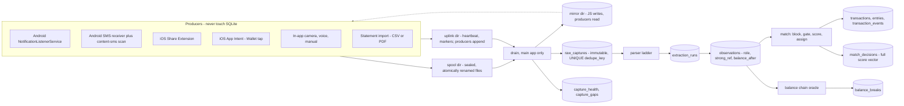
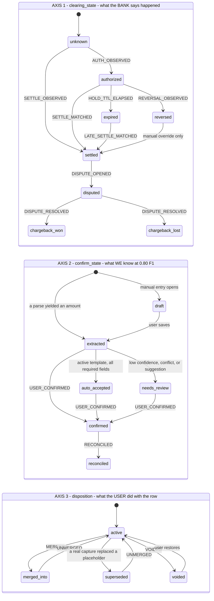
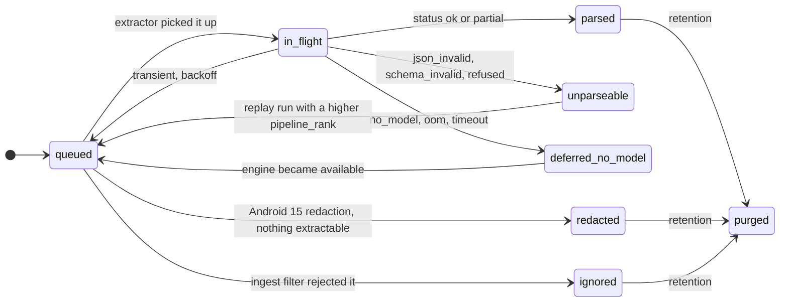

## The capture pipeline

The pipeline has **three layers that are never allowed to bleed into each other**, and the single
most important architectural statement in this section is where the boundaries fall:

| Layer | Table | What it is | What may never happen here |
| --- | --- | --- | --- |
| 1 | `raw_captures` | Immutable staging. One row per *delivery*. | No parsing, no normalization, no fuzziness. `dedupe_key` equality is the **only** thing that collapses two rows. |
| 2 | `extraction_runs` → `observations` | One row per *parse attempt*; the observation is the (capture, current extraction) pair with a role. | No overwriting. A better model produces a new run, never an edit. |
| 3 | `transactions` + `entries` + `transaction_events` | The ledger and its projection. | No capture-level concerns. The ledger never learns which channel a number came from — that lives on `observations` and `transaction_fields`. |

Every one of the three is append-only, which is what makes incremental export `WHERE id > :watermark`
and makes the event log double as the backup format (§3.6).

Conflating layers 1 and 2 is the root cause of the classic "two coffees merged into one" bug.
Exact delivery idempotency and cross-channel entity resolution are unrelated problems with
unrelated failure modes; §4.3 and §4.6 keep them apart on purpose.

---

### 4.1 The pipeline, end to end



The producers write sealed files into a spool directory and return. They cannot open the database:
on Android the notification listener has no query API to op-sqlite (its entire Kotlin surface is
`install()`, `getDylibPath()`, `moveAssetsDatabase()`), and on iOS a SQLCipher + WAL database inside
an App Group container is a deterministic `0xdead10cc` termination on every backgrounding. The same
spool is used by the in-app producers even though they *could* write directly, so that
`raw_captures` has exactly one writer and one code path on both platforms.

**But "producers never touch SQLite" is only half a contract, and the missing half is where this
design used to fail toward silence.** The ingest allowlist lives in `capture_senders`; the
diagnostics switch lives in `capture_senders.diagnostics_until`; the training-consent state lives in
`consent_grants`; the liveness record lives in `capture_health` and `capture_gaps`. Every one of
those is SQLCipher-resident and every one of them is needed by, or produced by, a Kotlin/Swift
producer that cannot open the database. Rediscovering that per feature produces four incompatible
half-mirrors. **§4.4.0 specifies the file-based mirror once**, in both directions, and every later
subsection references it rather than inventing its own channel.

---

### 4.2 The transaction lifecycle

Three orthogonal axes, per §3.5. A single status enum here would be a ~30-state product where most
states are illegal, and the illegal ones are the bugs.



#### 4.2.1 Axis 1 transitions, with guards and emitted events

| From | To | Trigger | Guard | Event written |
| --- | --- | --- | --- | --- |
| `unknown` | `authorized` | auth-shaped bank message | message matched an auth lexicon, or carries an auth code with no posting date | `AUTH_OBSERVED` |
| `unknown` | `settled` | statement line, posted/"cargo aplicado" message, or any cash receipt | cash never has an auth phase | `SETTLE_OBSERVED` |
| `unknown` | `settled` | **any capture on a channel that never observes clearing**: `manual_text`, `camera_receipt`, `screenshot_ocr`, `voice`, `ios_share`, `ios_shortcut`, `ios_wallet_intent`, `file_import` | applied by the repository **at insert**, in the same statement | `SETTLE_OBSERVED` |
| `unknown` | `settled` | `kind = 'opening_balance'`, created by onboarding/seed | never receives a bank message; D42 requires it to be a real balanced transaction | `SETTLE_OBSERVED` |
| `authorized` | `settled` | a settlement observation matched | passed §4.6 with role pair settle↔auth | `SETTLE_MATCHED` + `AMOUNT_ASSERTED` |
| `authorized` | `reversed` | explicit void / "reversa" / "cancelación" | — | `REVERSAL_OBSERVED` |
| `authorized` | `expired` | **local timer**, no bank message | `now > booked_at_utc + hold_ttl_days` **and** the account has an observed settlement history — see below | `HOLD_TTL_ELAPSED` — and the row enters `v_review_inbox`'s dedicated `expired_hold` branch |
| `expired` | `settled` | late settlement | expiry is **not** terminal — reopen | `LATE_SETTLE_MATCHED` + `AMOUNT_ASSERTED` |
| `settled` | `disputed` | user action | — | `DISPUTE_OPENED` |
| `disputed` | `chargeback_won` / `chargeback_lost` | resolution | won expects a linked credit transaction | `DISPUTE_RESOLVED` |
| `reversed` | `settled` | manual override only | never automatic | `USER_VALUE_SUPERSEDED` |

**Why the third and fourth rows exist, and how they compose with §3.5.2's predicate.** The table
previously enumerated only bank-message and cash triggers, so every capture on a channel that never
observes clearing sat at the `NOT NULL DEFAULT 'unknown'` forever — and `'unknown'` was not in the
reporting predicate. An iOS user, who has no passive capture *by construction*, therefore saw a
full timeline (`ix_txn_timeline` filters only `deleted_at` and `disposition`) against a **€0 spend
figure**, and onboarding's opening balance contributed nothing to `v_account_balances`, defeating
the entire point of D42.

§3 fixed this from the other end: **`'unknown'` is now inside the §3.5.2 reporting predicate**, so
a row can never be invisible in a total merely because its clearing state is unobserved. Both
halves are wanted and they are not redundant:

- **The predicate change is the safety net.** It guarantees no row is silently excluded, whatever
  the state machine does.
- **These transitions are the correctness statement.** A cash receipt, a photographed restaurant
  bill and an opening balance genuinely *are* settled — the money moved and no clearing event is
  coming. Leaving them at `'unknown'` would make the column mean "we don't know" for rows where we
  do, which then poisons the hold-expiry logic (§4.9's *"an account with no observed settlement
  history"* test), the settle↔auth blocking window, and any future report that distinguishes
  cleared from pending.

Sweep check **I14** (§3.21) is the residual guard, and it is deliberately narrower than
`clearing_state = 'unknown' AND confirm_state <> 'draft'`: it reports **bank-channel** rows still
at the default more than seven days after capture, which means the auth/settle state machine never
engaged for that sender. A blanket check would fire on every legitimately-unobserved manual entry.

`expired` is load-bearing and most apps omit it. A $1 fuel pre-auth or a $200 hotel hold that never
posts pollutes the ledger forever without it — and because the reporting predicate (§3.5.2) counts
`authorized`, the phantom hold is *in the user's spend number* until the timer fires. Defaults:
`hold_ttl_days` = 3 for `fuel`, 31 for `hotel` / `car_rental` / cruise, 8 for everything else.

**But expiry removes a real transaction from every spend total, so it can never be silent.** The
same timer fires whether the hold was phantom or the settlement message was simply *missed* — two
consecutive binding deaths (R19), or an iPhone, where settlement is never observed at all. Three
consequences, all mandatory:

1. **`v_review_inbox` carries a dedicated `expired_hold` branch** (§3.20) keyed on
   `clearing_state = 'expired'`, with the reason `hold_expired_did_this_go_through`. A
   confirmed-then-expired row matches none of the other union arms, so without this branch it
   leaves every total *and* every queue at once.
2. **`HOLD_TTL_ELAPSED` does NOT set `needs_review = 1`.** The dedicated branch already surfaces
   the row, and the transaction branch matches on `needs_review = 1`, so setting it would list the
   same expired hold **twice** in the inbox — under two different `item_kind`s with two different
   reasons. On the surface the design calls the app's main one (C7), machine-generated duplicate
   rows are exactly the dismiss-the-inbox reflex R17 warns about, and R8's genuine *"a merge ate a
   purchase"* finding gets dismissed alongside them. The flag stays for the cases §4.2.2 lists,
   which have no branch of their own; expiry has one.
3. **The timer only runs where the absence of a settlement message carries information.** On a
   platform or account with no observed `bank_settle` history — every iOS account without statement
   import, and any Android sender that has never produced a settlement role — expiry defaults to
   **ask**, not to a timer: `needs_review = 1` with the same prompt, `clearing_state` unchanged. An
   inferred expiry on a channel that structurally cannot observe settlements is not evidence, it is
   a coin flip that silently gives the user MXN 480 of budget headroom for a meal they ate.

#### 4.2.2 Axis 2 and the `needs_review` flag are different things

`confirm_state` is a ratchet the user drives forward. `needs_review INTEGER` is an orthogonal
**flag** the system raises and lowers. A settlement arriving after the user already confirmed at a
different amount does *not* drop `confirm_state` back — it stays `confirmed`, `needs_review` flips
to 1, and `USER_VALUE_SUPERSEDED` is written so the UI can say *"settled at 27.50 — you entered
25.00."* `v_review_inbox` (§3.20) already unions on `confirm_state IN ('extracted','needs_review')
OR needs_review = 1`, which is exactly this design.

`needs_review = 1` is raised by any of: `overall_confidence < CFG.confidence.review`, a required
field null, an open `field_conflicts` row, an open `balance_breaks` row pointing here, a
`match_decisions` row with `outcome='suggested'` and no `user_response`,
or `line_items_delta_minor` outside tolerance. **Not** by `HOLD_TTL_ELAPSED` — an expired hold
has its own `v_review_inbox` branch, and raising the flag as well would list it twice (§4.2.1).

> **`line_items_delta_minor` must be redefined before it can be a `needs_review` trigger.** §3.8
> defines it as `total − SUM(items where line_type='item')`, which excludes tax, tip, service
> charge, deposit and rounding lines — so a *perfectly extracted* Spanish restaurant receipt
> (items €42.00, IVA €8.82, tip €4.00, total €54.82) yields a delta of €12.82, 23% of the total,
> and lands in the inbox with zero extraction errors. Widening the tolerance to swallow 23% also
> swallows a genuine 27.50-vs-275.00 misparse on a small receipt, which is the failure §4.9 and
> §5.3.2 step 5 both exist to catch. Redefine as `total − SUM(amount_minor)` over all rows except
> `line_type IN ('subtotal','total')`, so a well-extracted receipt yields exactly 0 and the
> tolerance can be one minor unit plus `cash_rounding_minor`. The same section must state the sign
> convention, which is currently unstated and matters most for discounts: `line_items.amount_minor`
> is signed with the same sign as the transaction's category legs, so `discount` and `rounding`
> rows are negative, with `CHECK (line_type <> 'discount' OR amount_minor <= 0)`. Training the user
> to dismiss the inbox on every taxed receipt is exactly the R17 failure, and it takes R8's genuine
> *"a merge ate a purchase"* finding down with it.

`reconciled` requires an authoritative cross-check: a matched `bank_statement` observation, or a
continuous balance chain across this transaction. **On iOS the practical ceiling is `confirmed`**,
because there is no passive capture to build a chain from, and the UI must say so rather than
implying a reconciliation that never happened.

#### 4.2.3 Two conventions this section relies on

1. **Header amounts are unsigned magnitudes; `transactions.direction` carries the sign.**
   `entries.amount_minor` is signed. The §3.5 `CHECK` permits a negative header amount but the
   repository never writes one — the blocking query's shape (`direction = :dir` *and*
   `effective_amount_minor BETWEEN :a_lo AND :a_hi`) only makes sense under this convention, and
   the dedupe amount bands below all assume it.
2. **`transaction_events.seq` is allocated as `SELECT COALESCE(MAX(seq),0)+1 FROM transaction_events
   WHERE txn_id = ?` inside the same `BEGIN IMMEDIATE` as the insert.** `UNIQUE(txn_id, seq)`
   otherwise collides when a batch drain runs alongside a user edit, and the drain is the one path
   guaranteed to be writing dozens of events at once.

---

### 4.3 Layer 1 — exact delivery idempotency

`raw_captures.dedupe_key` is 64 lowercase hex, `UNIQUE`, and **must contain a timestamp assigned by
the OS or the content provider** — never the app's own receipt time, and never omitted.

| `source_channel` | `dedupe_key` = sha256 of |
| --- | --- |
| `android_notification`, `android_notification_sms` | `package ‖ sbn.getKey() ‖ sbn.getPostTime() ‖ canonical_text` |
| `android_sms` | `sender_address ‖ sms.date_ms ‖ body` |
| `ios_share`, `ios_shortcut` | `content_sha256 ‖ extension_invocation_uuid` |
| `ios_wallet_intent` | `card ‖ merchant ‖ amount_text ‖ intent_invocation_uuid` |
| `camera_receipt`, `screenshot_ocr` | `image_bytes` |
| `voice` | `audio_bytes ‖ recording_started_at` |
| `statement_import`, `file_import` | `file_sha256 ‖ line_number` |

`canonical_text` = `title ‖ "" ‖ text ‖ "" ‖ bigText ‖ "" ‖ subText`, NFC-normalized
with whitespace runs collapsed. Read every extra with `extras.getCharSequence(key)?.toString()` —
`Bundle.getString()` returns **null** for a `SpannableString`, which is what most posters actually
put there, and a null field silently changes the key.

Why `getPostTime()` and not `System.currentTimeMillis()`: `postTime` is assigned once at post and is
preserved when the same notification is re-delivered through `getActiveNotifications()` on rebind,
reboot or permission re-grant, so re-delivery is byte-identical. Two genuine coffee purchases three
minutes apart carry different `postTime`s and therefore different keys. **Omitting `postTime` merges
the two coffees; using the app's own clock duplicates every re-delivery.** Both failures are silent.

On conflict the drain does **not** drop the row:

```sql
UPDATE raw_captures SET seen_count = seen_count + 1, last_seen_at = :now WHERE dedupe_key = :k;
```

so re-delivery storms are observable rather than invisible.

**iOS is deliberately not idempotent across user actions.** A user who shares the same SMS twice
produces two captures, because on iOS the *user* is the delivery mechanism. Suppress it with a UI
prompt keyed on `content_hash` alone ("you already imported this"), never silently.

#### 4.3.0 Two Android notification behaviours that break the key, and the producer-side rejections

The `dedupe_key` above assumes one notification per event. Two very common Android behaviours
violate that, and both of them turn G5's under-merge bias (§4.8 rule 1) into a **duplicate
generator**, because G5 forbids fuzzy-merging two observations that share
`(source_channel, source_app, role)` and Layer 1 cannot collapse them either.

**(a) Group summaries.** An app posting more than one notification in a group also posts a group
summary; under `InboxStyle` that summary carries the child lines **verbatim, including amounts**,
with a different `sbn.getKey()` and a different `postTime`. Two spool records, two `raw_captures`
rows, two `bank_auth` observations, G5 blocks the comparison, G6 refuses the summary into the
child's slot — and the summary becomes a **second transaction** for the same purchase. The next
alert re-posts a three-line summary with a fresh `postTime` and resurrects both prior amounts
again, so duplicates grow superlinearly with notification volume.

> **The producer drops any `StatusBarNotification` where
> `(sbn.getNotification().flags & Notification.FLAG_GROUP_SUMMARY) != 0`.** Per the design's own
> never-drop-silently rule this is recorded as `process_state = 'ignored'`,
> `payload_text = NULL`, reason `group_summary` — so a bank that posts *only* summaries shows up in
> diagnostics as unread rather than going invisible. `getGroupKey()` and `isGroup()` are recorded
> in `payload_meta_json` for the children, because B3 needs to measure how many target banks do
> this.

**(b) In-place updates.** Banks routinely update a notification rather than posting a new one —
pending → confirmed, merchant name filled in once the acquirer resolves. The same `sbn.getKey()` is
re-posted with different text, so `canonical_text` differs and `dedupe_key` differs. That is **one
notification superseded, not two authorizations**, and §4.6.3 gives G5 an explicit escape for it
keyed on `raw_captures.source_ref` (= `sbn.getKey()`).

**(c) Relay-SMS sender recovery.** For `android_notification_sms` the posting package is the
messaging app, not the bank, so `source_app` alone cannot be allowlisted without admitting every
personal SMS on the device to disk (see §4.5.1). The producer must recover the *SMS sender* before
the allowlist test:

```text
1. EXTRA_TITLE                                            — the standard template
2. NotificationCompat.MessagingStyle
     .extractMessagingStyleFromNotification(n)
       → conversationTitle, else the per-Message sender    — what modern messaging apps actually use
3. neither resolves ⇒ REJECT as process_state = 'ignored', reason 'relay_sender_unresolved'.
   NEVER admit a relay notification whose sender cannot be recovered.
```

The recovered value is the `sub_identifier` the §4.4.0 mirror matches on, and the pair
`(messaging package, bank shortcode)` is what `capture_senders` keys the relay channel by.

#### 4.3.1 `transactions.dedupe_hash` — the one place a merge is a database constraint

§3.5 declares `dedupe_hash TEXT` under `ux_txn_dedupe` (`UNIQUE … WHERE dedupe_hash IS NOT NULL AND
deleted_at IS NULL AND disposition='active'`) but does not define it. It is defined here, and
narrowly, because a `UNIQUE` index is an *unconditional* collapse with no scoring and no review:

```text
dedupe_hash = sha256_hex( direction ‖ '|' ‖ account_key ‖ '|' ‖ ref_class ‖ '|' ‖ normalize(strong_ref) )

  account_key = account_id, else 'last4:' || card_last4
  ref_class   ∈ { 'arn', 'rrn', 'cfdi', 'statement_line' }

dedupe_hash is NULL — and the index therefore does not apply — unless BOTH:
  (a) the observation carries a strong_ref of a GLOBALLY UNIQUE class, and
  (b) account identity is known (account_id or card_last4).
```

A bare 6-digit **auth code is excluded on purpose**: auth codes recycle, they are unique only per
(card, merchant, day), and a hash collision under a `UNIQUE` index would delete a purchase with no
review step and no cloud copy to recover from. Auth codes are handled by gate **G3** in the scored
path instead, where a mismatch blocks a merge but a match only *raises a score*.

The write path is **SELECT-by-hash-then-attach**, never INSERT-and-catch: a caught constraint
violation gives you no transaction id to attach the observation to, and swallowing
`SQLITE_CONSTRAINT` inside a `BEGIN` is exactly the pattern §3.19 warns about.

This is what makes "v1 auto-merges only on an exact strong-identifier match" a property of the
database rather than a policy in application code.

---

### 4.4 Staging and the drain

#### 4.4.0 The native↔SQLite mirror contract

**One versioned, file-based contract, specified here and referenced everywhere else.** JS writes
files the producers read; producers append files the drain folds back into SQLite. No producer ever
opens the database, and no feature invents a second channel.

**Location and protection class.** All mirror and uplink files live under
`context.getFilesDir()/capture/` on Android — **credential-protected storage, never
`createDeviceProtectedStorageContext()`** (§2.8.1 settled this; §3.10's and §7.1.3's
device-protected prose is superseded) — and under the App Group container at
`NSFileProtectionCompleteUntilFirstUserAuthentication` on iOS. The spool (`spool/`) sits beside
them under the same root and the same class.

```text
<capture-root>/
  mirror/senders.v1.json       JS → producer.  Ingest allowlist + diagnostics + spool pubkey.
  mirror/consent.v1.json       JS → producer.  Per-channel training-consent snapshot source.
  uplink/heartbeat.log         producer → JS.  Fixed-width append-only liveness record.
  uplink/marker/<name>.<ms>    producer → JS.  Zero-byte fault markers (nomirror, spoolfull, …).
  spool/tmp|inbox|quarantine/  producer → JS.  §4.4.1.
```

**Direction 1 — JS → producer (`mirror/`).** Written by the drain, **write-tmp-then-`rename()` then
`fsync()` the directory**, immediately after any COMMIT that mutated `capture_senders`,
`consent_grants`, or the spool keypair. Never written by anything else.

```jsonc
// mirror/senders.v1.json
{
  "mirror_version": 47,              // monotonic; bumped in the same tx that wrote the rows
  "written_at": 1785712345678,
  "schema": 1,
  "spool_pubkey_hex": "…64 hex…",    // X25519 public half, see §4.4.1 — no longer build-time baked
  "self_package": "net.moneymanager.app",   // producer rejects its own notifications first
  "senders": [
    { "channel": "android_notification",     "identifier": "com.bbva.bbvamovil",
      "sub_identifier": null, "enabled": 1, "is_financial": 1, "diagnostics_until": null },
    { "channel": "android_notification_sms", "identifier": "com.google.android.apps.messaging",
      "sub_identifier": "BBVA", "enabled": 1, "is_financial": 1, "diagnostics_until": null },
    { "channel": "android_sms",              "identifier": "BBVA",
      "sub_identifier": null, "enabled": 1, "is_financial": 1, "diagnostics_until": 1785798745678 }
  ]
}
```

```jsonc
// mirror/consent.v1.json  — the producer's read-only view of the consent chokepoint
{ "mirror_version": 47,
  "retain_for_training": { "android_notification": 0, "android_notification_sms": 0,
                           "android_sms": 1, "camera_receipt": 1, "*": 0 } }
```

`consent_grants` (§5.5.1) remains the authority; this file is **derived state and never the
authority**. It exists so the producer can stamp a capture-time snapshot without a database.

**Direction 2 — producer → JS (`uplink/`).** Append-only, byte-oriented, no parsing risk:

- `heartbeat.log` — one fixed-width line (`<epoch_ms:13> <event:16> <detail:32>\n`, 63 bytes) on
  `onListenerConnected`, `onListenerDisconnected`, every accepted `onNotificationPosted`, and every
  `onNotificationPosted` rejected by the allowlist. Appended from the dedicated spool thread
  (§4.4.1), never from the callback thread.

  **The drain rotates, it does not truncate.** The producer appends to this file concurrently from
  a thread the drain does not control, so truncating in place loses records or leaves a torn line —
  the same durability class as a `rename()` without an `fsync()`, and it would silently corrupt the
  one signal §4.4.4 uses to detect a dead listener. Sequence: `rename()` to
  `uplink/heartbeat.<epoch_ms>.log`, `fsync()` the directory, read and fold the rotated file into
  `capture_health` / `capture_gaps`, `unlink()` it only after that transaction commits. The
  producer recreates `heartbeat.log` on its next append (open with `O_APPEND | O_CREAT`). A crash
  between rotate and fold leaves a rotated file the next drain picks up, so folding must be
  idempotent — it is, because it advances timestamps monotonically rather than accumulating.
- `uplink/marker/<name>.<epoch_ms>` — a zero-byte file. Names: `nomirror` (mirror missing, stale or
  unparseable), `spoolfull` (cap reached), `mirrorstale` (mirror_version older than the drain's
  last write, i.e. a restore delivered the database but not the mirror). The drain converts each
  into a `capture_gaps` row and deletes the marker.

**Fail-closed, and made safe by the marker.** A producer with no readable mirror **drops the
notification** — fail-open would put every notification on the device into `payload_text` and
falsify R22's "no third-party recipient by construction". Fail-closed alone would be silent loss,
which is exactly what this design forbids, so the *first* refusal in a mirror-outage window writes
`uplink/marker/nomirror.<ms>` and the drain opens a retroactive `capture_gaps` row with
`cause = 'mirror_unavailable'` spanning marker-mtime → drain time. Silence becomes *"capture was
down 14 days"*.

**Restore and transfer.** The mirror does not travel in `.mmbak` and is not a `<device-transfer>`
include — it is derived. **The drain therefore rewrites both mirror files unconditionally as its
first action on every app start**, before processing the inbox, so a restored or transferred phone
is capturing again the moment the app is opened once. Until then it is fail-closed and the
`nomirror` marker records the window. The restore-complete screen must say *"passive capture
resumes when you next open the app"* rather than implying it is already live.

**CI gates (for §7.3).** Extend **G-7** to assert the mirror path constant is identical in the
Kotlin producer and the TS drain. Add an instrumented gate: mutate `capture_senders`, run the
drain, tear down the JS runtime, post a synthetic notification, assert the producer's accept/reject
decision matches the table; then delete the mirror, post again, and assert a `nomirror` marker
exists and no spool file was written.

#### 4.4.1 The spool record

One file per capture, written under the capture root of §4.4.0 to `spool/tmp/<uuidv7>.part` and
`rename()`d into `spool/inbox/`. Media first, **manifest last** — the manifest's arrival is the
commit marker, so a producer killed mid-write leaves an orphan media file that the sweeper deletes
after a 24 h grace period, never a half-committed capture.

```text
spool record = [ version:u8 ][ len:u32 ][ libsodium sealed_box( plaintext ) ]
plaintext    = { manifest_json, blake3(manifest_json) }
```

**Durability sequence, specified rather than left to the implementer.** `rename()` is atomic on
APFS, ext4 and f2fs for the *directory entry* and says nothing about the file's data reaching
stable storage. ext4's replace-via-rename writeback heuristic under `data=ordered` is not matched
by f2fs, which is the default filesystem on most of the target Android devices — so a present
manifest with zero-length or truncated contents is a state a naive sequence permits, and its
symptom is a quarantined file the user can never recover:

```text
1. write spool/tmp/<uuidv7>.part
2. fd.sync()                        ← the data, not just the entry
3. rename() into spool/inbox/
4. fsync() the spool/inbox/ directory descriptor
```

The cost lands on the dedicated spool thread below, never on a callback thread, and it is accepted
because the spool file is the only copy of a capture between arrival and drain.

**Threading contract — `onNotificationPosted` and `onListenerConnected` are dispatched on the
service's main Looper, which is the same thread React Native renders on when the app is
foregrounded.** Hashing, `crypto_box_seal`, a `System.loadLibrary` for libsodium and two file
writes on that thread is an ANR, and the button Android offers on an ANR is **force-stop** — which
drops the user straight into the undetectable dead-listener state of §4.4.4. So:

1. On the callback thread the producer does **exactly two things**: read every extra out of
   `Notification.extras` with `extras.getCharSequence(key)?.toString()` into an immutable Kotlin
   data class (a `Bundle` is parcel-backed, must never cross a thread boundary and must not
   outlive the callback), and `post()` that object to a single dedicated `HandlerThread` owned by
   the service.
2. Everything else — the §4.4.0 mirror read, the ingest filter, NFC normalization, both SHA-256s,
   the sealed box, the four-step durability sequence and the `heartbeat.log` append — runs on that
   one thread, serialized, so spool ordering still matches arrival order.
3. `onListenerConnected` uses the same handoff, and its `getActiveNotifications()` reconciliation
   (routinely 50–200 records on a real phone) is **chunked** at `CFG.spool.reconcileChunk` per
   posted message so a rebind after a memory-pressure kill cannot monopolise the thread.
4. The producer rejects `mirror.self_package` **before** the allowlist test, so the §4.4.4 liveness
   probe and the "N items waiting" notification are never spooled back into the pipeline.

**The sealed-box key is derived from the DEK, and is the only secret in the capture path.** The
earlier design put an independent X25519 private key in the Keystore with exactly one wrap — the
failure §2.7.1 and §6.1 spend pages arguing is unacceptable for the DEK, recreated for the capture
inbox. It was also not implementable as written: `crypto_box_seal_open()` takes the raw 32-byte
secret scalar, and an Android Keystore key is non-extractable by design.

```text
spool_sk = crypto_kdf_derive_from_key(subkey_id = 1, ctx = "mmspool_", key = DEK)   // 32 bytes
spool_pk = crypto_scalarmult_base(spool_sk)
```

There is therefore exactly **one** secret in the system, it already carries two wraps (Keystore /
Keychain, and the recovery phrase per §6.1), and it survives every path the DEK survives —
including a Keystore invalidation recovered through the recovery-code flow. The public half can no
longer be baked into the producer at build time, because it is now per-install: it is written to
`mirror/senders.v1.json` as `spool_pubkey_hex` (§4.4.0) at provision time and on every mirror
rewrite. §2.8.1's CE-gating argument is preserved and in fact strengthened — the unsealing key is
derived from a `AfterFirstUnlock`/CE-gated secret, so a spool file still cannot be drained before
first unlock.

> **The one constraint this derivation imposes on §6, which §6 cannot infer:** the spool key now
> changes whenever the DEK changes, so **any operation that mints a new DEK orphans every sealed
> record still sitting in `spool/inbox`** — they become `spool_key_lost` gaps for transactions that
> were physically present on the device. Two such operations exist or are proposed: §6.5's restore
> (step 6 mints a fresh DEK) and the "my recovery phrase was exposed" flow that actually rotates
> the DEK rather than rewrapping it. **Both must run `drain({ ingestOnly: true })` to completion
> first and refuse to proceed while `spool/inbox` is non-empty**, surfacing *"N captures still to
> process"* rather than silently discarding them. Restore on a *new* device is unaffected: there is
> no spool there yet.

**Quarantine is a loss, and is recorded as one.** A file that fails to decrypt or fails its BLAKE3
check moves to `spool/quarantine/`. Do not describe this as recoverable-later: with the DEK-derived
key, a record that will not open is a record whose plaintext is gone. On quarantining, the drain
writes a `capture_gaps` row bracketed by the file's mtime with `cause = 'spool_key_lost'` (decrypt
failure) or `'unknown'` (BLAKE3 failure — a truncated write), so the loss surfaces in the review
inbox like every other gap instead of as a diagnostics counter nobody reads. `spool/quarantine/` is
capped by `CFG.spool.quarantineMaxItems` and `quarantineMaxAgeMs`, oldest-first, **not** retained
forever: an unopenable blob is not evidence, and the retention promise in §5.8 must not be silently
false because of a directory the purge never looks at.

Manifest fields map 1:1 onto `raw_captures` columns: `source_channel`, `source_app`, `source_ref`,
`spooled_at`, `delivered_at`, `event_at_hint`, `tz`, `utc_offset_min`, `device_locale`,
`device_region`, `payload_kind`, `payload_text`, `payload_meta_json`, `notification_template`,
`redaction_suspected`, `dedupe_key`, `content_hash`, media filename + sha256 + bytes,
`app_version_code`, `os_build`, plus two producer-side control fields: `captured_under_diagnostics`
(1 when `diagnostics_until > now` for this sender in the mirror) and `consent_snapshot` — the
capture-time value read from `mirror/consent.v1.json`.

> **`consent_snapshot` is a FLOOR, not the stamp.** §5.5.2 is normative:
> `raw_captures.training_opt_in = manifest.consent_snapshot AND current_grant_at_drain`. The drain
> may only ever **downgrade**. That is what makes both orderings safe — the capture-time snapshot
> stops a later opt-in retroactively relicensing a weekend of SMS, and the drain-time grant stops a
> revoke-then-drain sequence stamping 40 spooled captures as opted-in after the user said no.

**The inbox cap is split by payload kind, because one cap cannot serve both.** Text captures are
150–300 bytes (§5.8.1: 30/day for ten years is ~33 MB), so an item cap on them is a cap on how long
the user may go without opening the app — at Profile H's 20 captures/day, 500 items is 25 days. A
hospitalised user, or a secondary phone, blows through it and the ledger then shows five weeks of
spending that simply stops.

| Payload kind | Cap | At the cap |
| --- | --- | --- |
| `text`, `json` | `CFG.spool.maxTextBytes` (32 MiB ≈ 15 years of Profile H) — **no item cap** | Should be unreachable. If reached: `spoolfull` marker + gap, and a high-priority local notification. |
| `image`, `audio` | `CFG.spool.maxMediaItems` (500) **and** `CFG.spool.maxMediaBytes` (256 MiB) | iOS Share Extension refuses with *"Money Manager has N unprocessed items — open the app"*; Android media producers behave as below. |

**The Android producer's cap behaviour, stated because it has no UI at the moment of capture.** It
is a headless Kotlin service, so "show a message" is not available. On the first refusal it writes
`uplink/marker/spoolfull.<ms>` (§4.4.0) **and** posts a high-priority local notification, and the
drain converts the marker into a `capture_gaps` row with `cause = 'spool_full'` that stays open
until the drain brings the inbox back under the cap. Refusing silently is the one behaviour the
sole-system-of-record constraint forbids, and there was previously no gap cause that could express
it.

#### 4.4.2 The drain loop

**The drain is two stages with different durability requirements, and they run on different
triggers.** Stage 1 (`ingest`) turns spool files into committed `raw_captures` rows; it is cheap,
bounded, and needs no model. Stage 2 (`extractQueued`) is the expensive, interruptible one. The
earlier design ran both only on foreground, which meant a capture spooled on Saturday existed in no
backup and no restore path until the user next opened the app — and if the phone died first, the
transaction was gone with no `capture_gaps` row, because the listener never went down.

| Stage | Runs on |
| --- | --- |
| `writeMirrors` + `foldUplink` + `ingest` | app foreground; `ACTION_USER_UNLOCKED` (Android); the `DispatchSource` FD watch on the inbox (iOS); **and the same WorkManager liveness job that §4.4.4/D68 already schedules** — so the window between spooling and durability is minutes, not days |
| `extractQueued` | app foreground; the start of any background task; `BGContinuedProcessingTask` when the user explicitly asks to process a backlog |

Running stage 1 from the WorkManager job costs one short SQLCipher open and no model, and it is
what makes §6.4's opportunistic backup honest — **the backup path calls `ingest()` first**, so a
`.mmbak` never captures a database that is stale relative to the spool sitting next to it.

```ts
async function drain({ ingestOnly = false } = {}): Promise<void> {
  writeMirrors();                                 // §4.4.0 — ALWAYS first, even on a restored phone
  foldUplink();                                   // heartbeat.log + markers → capture_health / capture_gaps

  for (const file of sortByName(listDir('spool/inbox'))) {       // uuidv7 name ⇒ arrival order
    let m: Manifest;
    try { m = openSealed(file); }
    catch (e) { quarantine(file, e); continue; }  // moves the file AND opens a capture_gaps row

    // Idempotent by construction: the UNIQUE index on dedupe_key is the whole mechanism.
    const existing = db.get(`SELECT id FROM raw_captures WHERE dedupe_key = ?`, m.dedupe_key);
    if (existing) {
      db.run(`UPDATE raw_captures SET seen_count = seen_count + 1, last_seen_at = ? WHERE id = ?`,
             now(), existing.id);
    } else {
      db.tx(() => {
        if (m.media) insertMediaAsset(m);        // downscale HERE, never in the extension
        insertRawCapture(m, {
          process_state: 'queued',
          received_at:   now(),
          // CONSENT FLOOR, §4.4.1 / §5.5.2. AND, never OR: the drain may only downgrade.
          training_opt_in: m.consent_snapshot & currentGrant(m.source_channel),
          captured_under_diagnostics: m.captured_under_diagnostics,
          purge_after: purgeAfterFor(m),          // §5.8.2 — diagnostics captures ignore the grant
        });
      });
    }
    unlink(file);                                 // AFTER commit. NSFileCoordinator-wrapped on iOS.
  }
  if (!ingestOnly) await extractQueued();         // separate, interruptible, resumable stage
}
```

**The processed spool file is unlinked, not archived.** The earlier `moveTo('spool/processed')`
left the full manifest — including verbatim `payload_text` — on disk forever, in a directory the
§5.8.3 purge never touches and the §5.9 verification test structurally cannot see. The
`raw_captures` row is the durable copy and the `dedupe_key` index already makes a re-drain
idempotent, so `spool/processed` earned nothing and quietly falsified the retention story. If a
retained copy is ever wanted for debugging it must be bounded in `CFG` **and** unlinked by §5.8.3
step 7.

Downscaling happens in the drain, not the producer: a 12 MP HEIC is 2–4 MB, and an iOS Share
Extension dies at roughly 120 MB resident (an entitlement does **not** raise it), which a single
`UIImage` decode of a portrait photo can reach on its own. The extension copies bytes with
`loadFileRepresentation` + `copyItem`; the main app resizes to 1600 px long edge at JPEG q0.7
(~200–350 KB, still fully adequate for OCR re-runs and human review).

**Still not recoverable, and the restore screen must say so:** a capture that was spooled but never
ingested before the device was lost is in no backup, because it was never a row. Stage 1 on the
WorkManager job shrinks that window from days to minutes; it does not close it. §6.5.2's "what
restore cannot recover" list must name undrained spool records, driven from the spool state
recorded at the last successful backup rather than as a fixed step.

#### 4.4.3 `raw_captures.process_state` and the retry ladder



Backoff on transient failure: **1 m → 5 m → 30 m → 6 h → 24 h**, then park at
`deferred_no_model`. Nothing is ever discarded. `deferred_no_model` is a normal state, not an error:
the model may not be downloaded on first run, may have been deleted by the user to free space, or
may have OOMed on a 4 GB device.

`unparseable`, `redacted` and `deferred_no_model` captures **still appear in `v_review_inbox`** as
raw cards. Silence about a bank alert we could not read is the failure mode the whole design exists
to prevent — the UI says *"3 alerts from BBVA we couldn't read"*, not nothing.

The drain must be **incremental and interruptible**. Forty queued notifications after a weekend must
not block the ledger from rendering: `raw_captures` rows land first and in bulk, the extraction
stage runs per-capture and commits per-capture, and the timeline shows what has been parsed so far
with a "N still processing" affordance.

#### 4.4.4 Detecting that passive capture is dead

D68 and R19/R26 make a WorkManager liveness probe the detector of silently-dead capture. **It
cannot be the primary detector, for three independent reasons**, and the design must not promise a
gap-detection latency it derives from it:

1. **Force-stop cancels it.** OEM battery managers (MIUI autostart, Samsung, Honor), App
   Hibernation and the user all kill an app by force-stop, which puts the package in the stopped
   state and cancels its scheduled JobScheduler work. WorkManager does not reschedule until
   something in the app runs again — so the watchdog dies with the thing it watches.
2. **A `Worker` is a Kotlin class and op-sqlite has no native query API.** It cannot advance
   `capture_health` or open a `capture_gaps` row on its own. It writes through the §4.4.0 uplink
   and calls `drain({ ingestOnly: true })` when a JS runtime is available; those are its only two
   effects.
3. **Android 16 per-bucket job quota.** A weekly-use budgeting app falls to RARE/RESTRICTED, where
   the probe runs at most daily even when nothing is force-stopping it.

**So foreground-time reconciliation is the primary detector**, mirroring the stance the design
already takes for the drain (D65) and for backup (D101). On every app foreground, **before render**
and in this order:

```text
1. NotificationManagerCompat.getEnabledListenerPackages(context)
      → reads Settings.Secure.enabled_notification_listeners. No permission, no cost, works
        whether or not the app can post. This is the AUTHORITATIVE answer to permission_revoked
        and the ONLY thing that separates it from binding_died without a probe.
      → false ⇒ close/open a capture_gaps row with cause = 'permission_revoked',
        from_utc = capture_health.last_heartbeat_at.
2. PackageManager.isAutoRevokeWhitelisted()
      → false and the app has been idle ⇒ surface a deep link to
        ACTION_APPLICATION_DETAILS_SETTINGS. Hibernation is the one force-stop the user can
        pre-empt, so it is worth one row in the capture-health screen.
3. foldUplink()  (§4.4.0)
      → heartbeat.log advances capture_health.last_heartbeat_at / last_notification_seen_at.
        A heartbeat gap longer than CFG.health.heartbeatDeadMs with the grant still present is
        cause = 'force_stopped' (or 'hibernated' when step 2 says so, 'oem_killed' otherwise).
4. per-sender inter-arrival staleness
      → for each capture_senders row with enabled = 1 and ≥ CFG.health.arrivalMinSamples prior
        captures, compare now − last capture against that sender's learned inter-arrival
        distribution; beyond the p99 ⇒ open a gap for that sender alone. This is the only
        detector that survives BOTH a force-stop and a denied POST_NOTIFICATIONS.
5. probe result, if a probe is even possible — see below.
```

**If the user denied `POST_NOTIFICATIONS`, the probe does not exist and must not read as health.**
On Android 13+ posting any notification requires that runtime permission, and denial is ordinary
for an app that has not yet demonstrated value. R20 correctly says to check
`areNotificationsEnabled()` before treating a probe failure as death — but the design then stopped,
and `consecutive_probe_failures` simply stopped advancing, which is indistinguishable from healthy.
`capture_health.probe_available` makes the two states different **in data** rather than implied by
a NULL, and the capture-health UI must render *"we cannot self-test capture on this device"* as an
explicitly reduced-confidence state, never as a green tick.

The probe itself is unchanged where it *is* available: post to the app's own package (which the
producer rejects first, per §4.4.1), wait for `onNotificationPosted`, and on genuine failure
`requestUnbind(cn)` then `requestRebind(cn)` — **never** `setComponentEnabledSetting`, and never
rename the listener class after release (D68). `onListenerDisconnected()` is an orderly-unbind
callback and **does not fire on process kill**, so `last_disconnected_at` is null in exactly the
case that matters; the heartbeat, not that callback, is what step 3 reads.

---

### 4.5 Observations: role, authority, and the `value_source_rank` contract

An observation is `(raw_capture, its current extraction)` with a derived role. Role is assigned by
the classifier, not by the channel:

| `observations.role` | Assigned when | `evidence_authority` | `authority_rank` |
| --- | --- | --- | --- |
| `bank_statement` | `source_channel = 'statement_import'` | `statement_line` | **60** |
| `bank_settle` | posted/settled lexicon hit, or a posting date is present | `bank_settlement` | **50** |
| `bank_auth` | auth lexicon hit, or an auth code with no posting date | `bank_auth` | **40** |
| `wallet_tap` | `source_channel = 'ios_wallet_intent'` | `bank_auth` | **40** |
| `merchant_receipt` | receipt image / OCR / share of a merchant email | `merchant_receipt` | **30** |
| `user_manual` | `manual_text`, in-app entry, or any user edit | `user_assertion` | **20** |
| `voice` | `source_channel = 'voice'` | `user_assertion` | **20** |
| *(no observation)* | `kind = 'inferred_gap'` from the balance oracle | `inference` | **10** |

§3.11.4 constrains `authority_rank` to exactly `(60,50,40,30,20,10)` but never says which role maps
where. This table is that mapping, and it is a cross-section contract.

**`observations.strong_ref` is stored class-prefixed as `class:value`**, normalized — `auth:004417`,
`arn:74510926...`, `rrn:...`, `cfdi:<uuid>`, `folio:...`, `statement_line:...`. The schema types the
column as bare `TEXT`, so this format is a cross-section contract, and it is load-bearing for two
different mechanisms:

- **Gate G3 compares same-class pairs only.** An ARN and an auth code are incomparable identifiers,
  not disagreeing ones. Comparing them naively makes G3 fire on *every* statement import against a
  notification-derived auth code, which would spawn a duplicate for every reconciled transaction —
  the exact failure this pipeline exists to prevent. Same-class comparison also resolves the latent
  ambiguity in `gate(o, c)` below, where a candidate transaction has several observations and
  therefore several refs: the comparison is per class, against whichever ref of that class the
  candidate carries.
- **The globally-unique subset `{arn, rrn, cfdi, statement_line}` drives `dedupe_hash`** (§4.3.1).
  `auth` and `folio` participate in G3 and in `s_ref` but never in the `UNIQUE` index, because they
  recycle.

#### 4.5.1 `value_source_rank` must encode channel precedence, not just pipeline quality

**This is load-bearing and §3.11.4 leaves it undefined.** The equal-authority branch of the
replacement rule resolves on `value_source_rank`, then `observed_at`. Consider the ordinary Mexican
case: a bank SMS arrives, the messaging app posts a notification relaying it, and the provider row
is picked up by the periodic `content://sms` scan a few minutes later. Both are `bank_auth`
(authority 40) but on different channels, so `ux_observations_slot` correctly admits both. The
notification body is **truncated** and is subject to Android 15 redaction; the provider row is full
text and is never redacted. If `value_source_rank` only tracked pipeline quality, the truncated
notification could win on `observed_at` and silently degrade a correct parse.

> **The formula lives in exactly one place, and it is not here.** §5.2.2 owns
> `value_source_rank` and computes it at the chokepoint (§5.3.2 step 2 already says "never accept
> these from the caller"). This subsection contributes the **channel-precedence table** as input
> data to that formula, nothing more. Two independent formulas previously existed — this one
> (`channel_precedence * 1000 + pipeline_rank`) and §5.2.2's (`ENGINE_BASE * 100 + pipeline_rank`)
> — and they give **opposite answers** for the case that matters most, with both producing
> plausible-looking integers so the divergence is invisible. §5.2.2's composite is now normative:
>
> ```text
> value_source_rank = channel_precedence * 100000 + ENGINE_BASE[value_source] * 100
>                   + min(pipeline_rank, 99)
> ```

```text
channel_precedence  (input to §5.2.2; the ONLY definition of this table)
  90  statement_import, file_import
  80  android_sms                        -- full text, never redacted, has a sender address
  70  ios_wallet_intent                  -- device-authoritative for the tap
  60  android_notification_sms           -- messaging app relaying a bank SMS
  50  android_notification               -- may be truncated or redacted
  40  camera_receipt, ios_share
  30  screenshot_ocr
  20  voice
  10  manual_text          -- low CHANNEL precedence; user edits win via pinned_by_user, not here
```

Source precedence `sms > notification_sms > notification` is the direct consequence, and it is the
right one: the provider row has full untruncated text, a sender address, and immunity from the
Android 15 sensitive-notification classifier.

> **Read the last line of that table against §5.3.2 step 6 before shipping either.** Under the
> composite formula a user edit on `manual_text` scores ≈ 1,001,000 and an `android_sms`
> re-extraction ≈ 8,000,403, so **the machine outranks the human on the equal-authority
> tiebreak**. That is only safe because §5.3.2 step 6 now sets `pinned_by_user = 1` and
> `pinned_at_authority = cur.authority_rank` on every user write to a bank-authoritative field: the
> SMS arrives at authority 40 against a pin taken at 40, `40 > 40` is false, it hits
> `REJECT_PINNED`, and the tiebreak is never reached. A settlement (50) or a statement line (60)
> still supersedes, loudly, via `USER_VALUE_SUPERSEDED`. **Shipping this formula without that
> auto-pin makes §4.5.1's own failure mode unconditional** — there would then be no configuration
> in which the user's correction survives a re-parse of the message they were correcting.

**The relay channel cannot be allowlisted by package alone.** In SMS-heavy markets
`android_notification_sms` is the primary Android channel until READ_SMS ships, and the posting
package is `com.google.android.apps.messaging` / `com.samsung.android.messaging`. Allowlisting the
messaging app admits every personal SMS on the device to the amount-pattern test and, on a match,
to `payload_text` — *"te debo 450, te pago el viernes"* is a 30-day-retained bank-grade record, and
R22's *"per-package and per-sender allowlist enforced in the producer"* becomes untrue in exactly
the configuration the target market runs. The fix is structural, in three parts, and all three are
required: `capture_senders` gains `'android_notification_sms'` as a channel value and a nullable
`sub_identifier` (§3, reconciled in §4.17); the producer resolves the SMS sender per §4.3.0(c) and rejects
when it cannot; and gate **G-19** runs its OTP assertion over the relay channel as well as
`android_sms`.

---

### 4.6 Layer 2 — the dedupe algorithm

Cross-channel entity resolution. Runs **only between different `source_channel` values**, once per
observation, over `observations` — never over `raw_captures`.

#### 4.6.0 Matcher idempotency

Nothing in the schema stops the matcher re-evaluating an observation it already decided. During a
replay run, or a drain of forty queued captures, that produces duplicate `suggested` rows and floods
the review inbox.

```text
Evaluate observation O iff:
    no match_decisions row exists for O at the current CFG.algoVersion
  OR (algo_version bumped AND the prior row has user_response IS NULL)

A decision the user has responded to is NEVER re-asked. Rejections additionally write a
match_vetoes row keyed on CAPTURE ids, which gate G7 honours forever, including during replay.
```

#### 4.6.1 Blocking

The indexed pre-filter (`ix_txn_block` exists for exactly this shape, §3.5):

```sql
SELECT t.* FROM transactions t
 WHERE t.deleted_at IS NULL AND t.disposition = 'active'
   AND t.direction = :dir
   AND (t.currency_code = :cur OR t.reporting_currency_code = :cur)
   AND t.booked_at_utc BETWEEN :t_lo AND :t_hi
   AND t.effective_amount_minor BETWEEN :a_lo AND :a_hi
   AND (t.account_id IS NULL OR :acct IS NULL OR t.account_id = :acct)
 LIMIT 200;
```

Everything fuzzy runs in JS over those ≤200 rows. No SQL-level fuzzy matching, no FTS in the match
path, no trigram extension.

#### 4.6.2 Windows and amount bands, per role pair

`:t_lo`/`:t_hi` and `:a_lo`/`:a_hi` come from this table, keyed on (incoming role, candidate role).
All windows are relative to the candidate's `event_at_utc`, which is the notification `postTime` /
`sms.date` / receipt printed time / auth time — **never** `received_at`, and never a posting date.

| Incoming | Candidate | Time window | Amount band | τ (`s_time`) |
| --- | --- | --- | --- | --- |
| `bank_auth` | `bank_auth` (other channel) | −10 min … +10 min | exact | 120 s |
| `bank_settle` | `bank_settle` (other channel) | −10 min … +10 min | exact | 120 s |
| `bank_settle` | `bank_auth` | −1 d … **+14 d** | class-dependent, below | 3 d |
| `merchant_receipt` | `bank_auth` / `bank_settle` | **−15 min … +120 min** | `[x, x × 1.25]` or exact | 1800 s |
| `wallet_tap` | `bank_auth` / `bank_settle` / `merchant_receipt` | −5 min … +120 min | `[x, x × 1.25]` or exact | 1800 s |
| `bank_statement` | any | −5 d … +5 d | exact | 5 d |
| `user_manual` | any | −3 d … +3 d | ±2 % or ±1 minor unit | 1 d |
| `voice` | any | −24 h … +1 h | ±5 % | 4 h |

The 14-day settlement window is the observed pending→posted range (1–5 business days typical, up to
14 in rare cases). Receipt −15 min absorbs thermal-register clock drift; +120 min absorbs a
restaurant's end-of-night batch close.

Class-dependent settle↔auth band, driven by `merchants.merchant_class`:

```text
TIP_CLASSES     = { restaurant, bar, taxi, salon }
                  band = [auth × 1.00, auth × 1.25]
PREAUTH_CLASSES = { fuel, hotel, car_rental, ev_charging }
                  band = UNBOUNDED.  A $1 fuel auth settling at $58 is normal, so the auth
                  amount carries no information: w_amount := 0 and renormalize, AND require
                  s_merchant ≥ 0.90 AND same account before any auto decision.
otherwise         band = [auth × 0.98, auth × 1.02] ∪ {exact}
```

The 1.25 ceiling is not arbitrary: Mastercard allows a 20 % tip tolerance and Visa allows 15 %
authorization-to-clearing plus gratuity up to 20 % of the base amount. Beyond ~1.25 the pair is a
**conflict**, not a match.

#### 4.6.3 The gates

Any gate firing discards the candidate — with **one exception**, `G5_supersede`, which is a
resolution rather than a rejection and is handled by `assignBatch` before scoring. The names are
the `match_decisions.blocked_by` enum values from §3.12, which must gain `'G5_supersede'` (§4.17).

```ts
function gate(o: Observation, c: Candidate): GateName | null {
  if (!currencyCompatible(o, c))                    return 'G1_currency';
  if (o.direction !== c.direction)                  return 'G2_direction';   // refunds: separate pass
  // SAME CLASS ONLY. An 'arn:' and an 'auth:' are incomparable, not contradictory.
  if (refsConflictWithinClass(o.strongRefs, c.strongRefs)) return 'G3_strong_ref';
  if (o.accountKey && c.accountKey &&
      o.accountKey !== c.accountKey)                return 'G4_account';
  // ESCAPE (§4.3.0b): an IDENTICAL raw_captures.source_ref — sbn.getKey() — on the same channel
  // is ONE notification updated in place (pending → confirmed, merchant filled in later), not two
  // authorizations, and must resolve as a SUPERSEDE rather than a second transaction.
  // gate() STAYS PURE: it returns a sentinel and assignBatch acts on it. Doing the supersede here
  // would fire it inside the .filter() pass over up to 200 candidates, before any decision exists,
  // and again on every dry-run, replay and shadow pass that re-evaluates the same pair.
  if (sameChannelAndRole(o, c))
    return sameSourceRef(o, c) ? 'G5_supersede' : 'G5_same_channel';
  if (slotOccupied(c.txnId, o.sourceChannel, o.role)) return 'G6_slot_occupied';
  if (vetoExists(o.rawCaptureId, c.captureIds))     return 'G7_veto';
  if (c.confirmState === 'reconciled' &&
      o.role !== 'bank_statement')                  return 'G8_reconciled';
  if (violatesConservation(o, c))                   return 'G9_conservation';
  return null;
}
```

`currencyCompatible` is true when the codes match, or when both sides carry an original-currency
amount and an implied rate within `CFG.fx.impliedRateBand` (±3 %) of the reference rate for that
date from `fx_rates`.

`refsConflictWithinClass(a, b)` is true iff there exists a class present on **both** sides whose
values differ after normalization. Classes present on only one side are ignored — that is the
whole point of §4.5's `class:value` format, and it is what lets a statement line (`arn:`) attach to
a transaction whose only identifier so far is a notification's `auth:` code.

**G5 keys on `(source_channel, source_app, role)` and its escape keys on `source_ref`, so all three
must be denormalized onto `observations`** (§3, reconciled in §4.17; §7.5's note N3 already asks for
`source_app` for the same reason). Joining back to `raw_captures` inside the gate turns the hottest
loop in the matcher into a two-table check for no benefit.

**`'G5_supersede'` is a fourth outcome, not a gate result.** It is neither a block nor a score, and
`assignBatch` resolves it in a dedicated pass 0 before any pair is scored (§4.6.5).

`supersedeInPlace(o, c)` is not a merge: the new observation replaces the occupant of
`(txn_id, source_channel, role)`, the displaced observation keeps its `raw_captures` row and gets
`txn_id = NULL`, the transaction identity is unchanged, and the field writes go through
`commitFieldValues` (§5.3) like any other — so a pinned user correction on the merchant survives a
bank filling that merchant in an hour later. It fires only when the two captures carry the same
non-null `source_ref` on the same channel, which on Android means literally the same
`StatusBarNotification` key. Because the pair never reaches `score()`, it can never also be
recorded as `NEW` or `SUGGEST` against a transaction whose slot has already been repointed.

Two schema consequences, tracked in §4.17: `match_decisions.outcome` must admit `'supersede'` and
`blocked_by` must admit `'G5_supersede'`. Both are still closed `CHECK` lists in §3.12, so without
them the drain hits `SQLITE_CONSTRAINT` inside `BEGIN IMMEDIATE` and — per D40 — loses the whole
queued batch rather than one row.

**G8 downgrades, it does not reject.** A receipt shared three days after a statement import would
otherwise silently become a second transaction. G8 forces `outcome = 'suggested'` — never `'new'` —
so the user can attach it by hand and the reconciled row keeps its authority.

G6 is enforced by the database (`ux_observations_slot`), not by this function; the check here exists
so the matcher produces a *reason* instead of a constraint violation.

G9, the conservation invariant, per (account, local date):

```text
count(active transactions) ≥ count(distinct bank_auth observations)
                             − count(reversals) − count(expiries)
```

A merge that would violate it is rejected outright. It is a cheap global guard against a scoring
regression silently eating purchases, and the startup sweep re-runs it as check I5 (§3.21).

#### 4.6.4 Scoring

Weights sum to 1.0 and are **renormalized** whenever a component is dropped.

```ts
const W = { amount: 0.30, time: 0.20, merchant: 0.25, account: 0.15, ref: 0.10 };

s_amount:
  exact                                     → 1.00
  |Δ| ≤ 1 minor unit                        → 0.95
  TIP settle/auth, r = settle/auth ∈ [1,1.25]
                                            → 1 − 0.6 · (r − 1) / 0.25
  PREAUTH settle/auth                       → drop the component (w := 0), renormalize
  cross-currency, both original amounts known
                                            → exact comparison in the original currency
  cross-currency, only converted known
                                            → clamp(1 − |implied/ref − 1| / 0.03, 0, 1)
  otherwise                                 → 0

s_time     = exp(−|Δt| / τ)                 // τ from the role-pair table above
s_merchant = 1.0 if both resolve to the same merchants.id via merchant_patterns
             else max(tokenSetJaccard, trigramDice) over normalized descriptors
             else drop the component if either side has no descriptor at all
s_account  = 1.0 same account_id or same card_last4;  0.5 if exactly one is unknown
s_ref      = 1.0 if a SAME-CLASS pair matches exactly
             else DROP the component and renormalize, when no same-class pair exists at all
                                              // differing same-class refs already died at G3,
                                              // so this component is never 0 — it is 1 or absent

score = Σ wᵢ · sᵢ
      + 0.25  if a strong reference matched          (capped at 1.0)
      − 0.20  if density ≥ 2
```

Descriptor normalization strips acquirer noise before comparison — leading `SQ *`, `SUMUP *`,
`PAYPAL *`, `IZ *`, `MP*`, trailing city/state/store-number tokens, embedded dates, repeated
whitespace. It is **one versioned function**; changing it invalidates every stored
`merchant_patterns.normalized` value, so the version is recorded and a change triggers a
recomputation pass.

#### 4.6.5 Decision, and assignment rather than pairwise

```text
AUTO_MERGE   score ≥ 0.88  AND  (best − second_best) ≥ 0.12  AND  density < 2
SUGGEST      0.55 ≤ score < 0.88,  or ≥ 0.88 with insufficient margin,  or G8 fired
NEW          otherwise
```

**Density escalation.** `density` = the number of near-identical candidates in the block. At
density ≥ 2, auto-merge additionally requires a matching strong identifier *or* margin ≥ 0.25;
otherwise the whole cluster goes to review as a *group* question — *"two charges of 4.50 at Blue
Bottle between 09:12 and 09:15, and two receipts — is this two purchases or one?"* Ambiguity **is**
the two-coffees case, and asking is the correct behaviour.

**Batches are a bipartite assignment with capacity 1 on both sides, never independent pairwise
decisions.** Independent decisions are precisely what merge two receipts and two SMS into one
transaction.

```ts
function assignBatch(obs: Observation[]): Decision[] {
  const usedObs = new Set<string>(), usedCand = new Set<string>();
  const out: Decision[] = [];

  // PASS 0 — in-place notification updates (§4.6.3). Resolved before scoring, because the pair is
  // one notification superseding itself and must never also be scored as NEW or SUGGEST against a
  // transaction whose slot has already been repointed. gate() stays pure; the mutation is here.
  for (const o of obs)
    for (const c of block(o))
      if (gate(o, c) === 'G5_supersede' && !usedObs.has(o.id)) {
        supersedeInPlace(o, c);
        usedObs.add(o.id);
        out.push(record({ o, c }, 'SUPERSEDE'));
      }

  const pairs = obs.filter(o => !usedObs.has(o.id))
    .flatMap(o => block(o)
      .filter(c => gate(o, c) === null)
      .map(c => ({ o, c, ...score(o, c) })))
    .sort((a, b) => b.score - a.score);

  for (const p of pairs) {
    if (usedObs.has(p.o.id) || usedCand.has(p.c.txnId)) continue;
    const d = decide(p);                       // AUTO_MERGE | SUGGEST | NEW
    if (d === 'AUTO_MERGE') { usedObs.add(p.o.id); usedCand.add(p.c.txnId); }
    out.push(record(p, d));                    // always writes a match_decisions row
  }
  for (const o of obs) if (!usedObs.has(o.id)) out.push(recordNew(o));
  return out;
}
```

**One assignment pass per import, not per line, and chunk-transactional** — a statement import that
is killed halfway must not leave half a statement attached to the ledger with the other half
unrepresented. Chunk size is `CFG.match.batchChunk` lines, each chunk one `BEGIN IMMEDIATE`, with a
resumable watermark on the import row.

Every evaluation writes a `match_decisions` row with its full score vector, `algo_version`, and
`blocked_by` when gated. That table is three things at once: the audit trail when a user asks *"why
did you merge these"*, the labelled local dataset for tuning the weights with zero telemetry, and
the source of vetoes.

#### 4.6.6 The product decision, stated so it cannot be quietly reversed

**Bias to under-merge.** A leftover duplicate is *visible* — the user sees two coffees and taps
merge — and recoverable. A wrong merge is *invisible*: a purchase simply disappears, spend is
understated, the balance chain quietly breaks, and with no cloud backup and the on-device DB as
sole system of record it is unrecoverable in practice. Every threshold above is set on the
conservative side and every tie goes to *"two transactions plus a suggestion"*.

This extends to the UI: the review inbox reads *"possible duplicate"* with a merge button. It never
auto-collapses with an undo toast.

---

### 4.7 Scenario A — one purchase, four channels

MXN 480.00 at a restaurant. The bank posts a push, sends an SMS, the user photographs the receipt,
and three days later imports the statement.

| # | Arrival | `source_channel` | `role` | Slot | Outcome |
| --- | --- | --- | --- | --- | --- |
| 1 | 20:14:03 | `android_notification` | `bank_auth` | free | **NEW** → txn T, `clearing_state='authorized'`, `authorized_amount_minor = 48000` |
| 2 | 20:14:41 | `android_sms` | `bank_auth` | free (different channel) | scored vs T |
| 3 | 21:02 | `camera_receipt` | `merchant_receipt` | free | scored vs T |
| 4 | +3 d | `statement_import` | `bank_statement` | free | scored vs T |

**Row 2.** G5 does not fire — same role, *different* channel, which is exactly the case Layer 2
exists for. Window −10 min…+10 min: Δt = 38 s ⇒ `s_time = exp(−38/120) = 0.73`. Amount exact ⇒ 1.0.
Same `card_last4` ⇒ `s_account = 1.0`. Both carry the same 6-digit auth code ⇒ `s_ref = 1.0` **and**
the +0.25 strong-reference adjustment. Merchant descriptors normalize to the same
`merchant_patterns` row ⇒ 1.0. Score = 0.30 + 0.146 + 0.25 + 0.15 + 0.10 = 0.946, +0.25 → capped
1.0. Density 1, margin unbounded ⇒ **AUTO_MERGE**. The SMS observation attaches to T in slot
`(android_sms, bank_auth)`.

Note the auth code did **not** produce a `dedupe_hash` (§4.3.1) — it is a recycling 6-digit code, so
it raised the score and satisfied G3 rather than short-circuiting the whole path.

Now `transaction_fields` has two `bank_auth` candidates at authority 40. The equal-authority branch
resolves on `value_source_rank`: `android_sms` = 80·1000 + rank vs `android_notification` =
50·1000 + rank. **The SMS wins regardless of arrival order or pipeline rank**, which is the point of
§4.5.1 — the notification body was truncated at "Compra por MXN 480.00 en LA DOC…" and the SMS
carries the full merchant string and the running balance.

**Row 3.** Receipt vs auth, window −15 min…+120 min, Δt = 48 min ⇒ `s_time = exp(−2880/1800) =
0.20`. The receipt total is 480.00 exactly ⇒ `s_amount = 1.0`. No strong ref on the receipt ⇒
`s_ref` component dropped and weights renormalized over the remaining 0.90. `s_merchant = 1.0`,
`s_account = 0.5` (the receipt knows no account). Score =
(0.30 + 0.20·0.202 + 0.25 + 0.15·0.5) / 0.90 = 0.665 / 0.90 ≈ **0.74** ⇒ **SUGGEST**, not auto.
Correct: at 0.80 F1
a receipt total is the least reliable number in the pipeline, and the user confirms with one tap.
On confirm, the receipt's `line_items` attach to T and `line_items_delta_minor` is computed.

**Row 4.** Statement line, authority 60, exact amount, ±5 d window. It carries a globally unique
`external_id`, so **`dedupe_hash` is set** — but T's `dedupe_hash` is NULL (no globally unique ref
until now), so there is no constraint short-circuit and the scored path runs. The statement carries
`arn:…` while T carries only `auth:…`: **different classes, so G3 does not fire and `s_ref` is
dropped** rather than scored 0 — this is precisely the case §4.5 exists for. Exact amount, exact
account, `s_time = exp(−3d/5d) = 0.55`, renormalized over 0.90 ⇒
(0.30 + 0.20·0.549 + 0.25 + 0.15) / 0.90 ≈ **0.90** with a clear margin ⇒ **AUTO_MERGE**. On
attach: `clearing_state → settled`, `confirm_state → reconciled`, `dedupe_hash` written onto T, and
`RECONCILED` + `SETTLE_MATCHED` events.

**Under the v1 configuration (§4.16) rows 2 and 4 land as `suggested`, not `AUTO_MERGE`** — neither
carries a `dedupe_hash` match, and v1 auto-merges on nothing else. The scores above are what the
algorithm computes; they become auto-merges only once the thresholds are enabled per role-pair
against the local `match_decisions` dataset. Anyone implementing from this walkthrough needs that
sentence, or the shipped behaviour will silently disagree with it.

**Final shape: one transaction, four observations in four distinct slots, four rows in
`match_decisions`, zero rows deleted.** Every input is still individually inspectable, which is what
makes unmerge possible and what feeds the FunctionGemma harvest.

---

### 4.8 Scenario B — two identical coffees, three minutes apart

Two MXN 45.00 purchases at the same café, 09:12 and 09:15. Each produces a push and an SMS: four
observations, and the correct answer is **two** transactions.

Five **structural** rules do this. None of them is a tolerance:

1. **G5, the same-channel rule.** The two pushes are both `(android_notification, bank_auth)`. They
   are never fuzzy-compared — only `dedupe_key` equality could collapse them, and their `postTime`s
   differ by 180 000 ms. A bank emits exactly one auth message per authorization, so two messages
   from one channel are two authorizations. **This rule alone removes most of the false-merge
   surface**, and it is why the primary idempotency key must contain `postTime`.
   Two Android behaviours would otherwise violate the premise and are handled *before* this rule
   rather than by relaxing it: a **group summary** never reaches the matcher because the producer
   drops it (§4.3.0a), and an **in-place update** carries the same `sbn.getKey()`, which is G5's
   only escape (§4.6.3). Both coffees here carry different keys, so neither applies.
2. **G6, slot capacity.** Once push #1 occupies `(android_notification, bank_auth)` on T₁, push #2
   cannot occupy it. Enforced by `ux_observations_slot`, in the database, not in this code.
3. **G3, the strong-identifier gate.** Two coffees have different auth codes. Both refs are the
   same class (`auth:`) and their values differ, so merging is forbidden *regardless of score* —
   this is the definitive separator whenever the bank includes an auth code.
4. **Density escalation.** With two near-identical candidates in the block, auto-merge for SMS #2
   would require a matching strong identifier or margin ≥ 0.25. Neither holds, so the cluster goes
   to review as one group question rather than four independent yes/nos.
5. **G9, conservation.** `count(active transactions) ≥ count(distinct bank_auth observations) −
   reversals − expiries` on that account-day. Any merge that would take the count from 2 to 1 while
   two distinct auth observations exist is rejected.

The scored path then does the right thing anyway: SMS #1 vs T₁ scores 1.0 (exact time, exact ref)
while SMS #1 vs T₂ hits G3 on the auth code — same class (`auth:`), different values. If the bank
omits auth codes entirely, G3 has nothing to compare and the scored path still separates them:
Δt = 180 s against τ = 120 s gives `s_time = exp(−1.5) = 0.22`, so the cross-pair scores
(0.30 + 0.20·0.223 + 0.25 + 0.15) / 0.90 ≈ **0.83**, which the density-≥2 penalty of 0.20 takes to
≈ **0.63** — **SUGGEST** on either side of the penalty, never auto. The assignment pass then takes
the higher-scoring pairing first, so SMS #1 lands on T₁ and SMS #2 on T₂ by capacity.

If the user answers *"these are two different coffees"*, a `match_vetoes` row is written **keyed on
capture ids**, not transaction ids, because transaction ids change under merge and unmerge while
capture ids never do. G7 honours it forever, including during replay: a smarter model is not
allowed to overrule the user.

---

### 4.9 Auth hold → settlement

The settlement amount is recorded as an **additional asserted amount**, never as an overwrite. The
original survives in three independent places: `raw_captures.payload_text` (immutable),
`transactions.authorized_amount_minor`, and the `AMOUNT_ASSERTED` event payload
(`{"amount_minor":2750,"prev":2500}`).

Applying a settlement is a **ledger mutation**, so it follows the seal protocol from §3.7.1:

```ts
db.tx('BEGIN IMMEDIATE', () => {
  db.run(`DELETE FROM transaction_seals WHERE txn_id = ?`, T);        // unseal

  // clearing_state MUST flip in the SAME statement: CHECK (clearing_state <> 'authorized'
  // OR settled_amount_minor IS NULL) rejects the two-step version.
  //
  // reporting_* IS IN THE DIRTY SET. effective_amount_minor is STORED and updates itself;
  // reporting_amount_minor is a PLAIN COLUMN and does not. Omitting it leaves every base-currency
  // report short by the tip, forever, on every tipped transaction — and because
  // reporting_amount_minor did not change, trg_budget_stale_on_reporting_change does not even
  // fire, so the budget is recomputed from the stale number.
  db.run(`UPDATE transactions
             SET settled_amount_minor = ?, bank_currency_code = ?, bank_exponent = ?,
                 clearing_state = 'settled',
                 tip_minor = ?, posted_at_utc = ?, posted_local_date = ?,
                 reporting_amount_minor = ?, reporting_rate_id = ?,
                 reporting_rate_num = ?, reporting_rate_den = ?, reporting_rate_date = ?,
                 updated_at = ?, hlc = ?
           WHERE id = ?`, …);                                          // dirty columns only

  rewriteLegs(T);                       // §4.9.1 — RE-SCALES, does not rebuild, when split
  db.run(`INSERT INTO transaction_seals (txn_id, sealed_at, leg_count) VALUES (?,?,?)`, …);
  appendEvents(T, ['SETTLE_MATCHED', 'AMOUNT_ASSERTED']);
});
```

**The reporting conversion is always taken over `effective_amount_minor`, never over
`amount_minor`** — here and in §3.3.4's re-derivation job, which must be corrected to match or it
will *reconfirm* the pre-settlement number on its next pass. Skipping the conversion is only legal
for `reporting_source IN ('actual','manual')` or `reporting_locked = 1` (D35).

**The auth/settle amounts are denominated in the CARD's currency, which is not necessarily the
header's.** §3.5 defines `currency_code` as the currency of the economic event — the receipt's —
while `authorized_amount_minor` and `settled_amount_minor` come from a bank message in the card's.
A ¥5,000 Tokyo purchase on a USD card yields `currency_code = 'JPY', amount_minor = 5000` and
`authorized_amount_minor = 3342` (USD), so an `effective_amount_minor` defined as a bare
`COALESCE(settled, authorized, amount)` silently mixes two currencies in one untyped integer —
150× off — and `ix_txn_block`'s amount band then searches for the settlement near ¥3,342 instead of
¥5,000 and never blocks. §3.5 now carries **one** `(bank_currency_code, bank_exponent)` pair for
the auth/settle family and defines `effective_amount_minor` so it never leaves `currency_code`;
the settle path writes that pair alongside the amount, and §4.6.1's blocking query uses
`ix_txn_block_bank` when the incoming observation is denominated in the bank's currency.

`effective_amount_minor` and `adjustment_minor` (STORED, `settled − authorized` — both in
`bank_currency_code` by construction, so it is coherent) update themselves. `tip_minor` is set only
when `adjustment_minor > 0` **and** `merchant_class ∈ TIP_CLASSES`; the UI renders
*"MXN 25.00 authorized → 27.50 settled (tip 2.50)"*.

#### 4.9.1 `rewriteLegs(T)` re-scales an existing split; it rebuilds only the single-category case

`buildEntries(draft) → Entry[]` (§3.7) is pure and takes the **flat façade**, which has no
representation for a multi-way split. A blind rebuild on every settlement and every money-bearing
edit therefore **silently un-splits any receipt the user split across categories** — and nothing
catches it: the rebuilt two-leg transaction still sums to zero, so the seal passes and sweep check
I1 reports the ledger clean, while `line_items.entry_id` (declared `ON DELETE SET NULL`, in direct
contradiction of rule 6 / D50) quietly nulls on all 23 line items. The same mechanism destroys the
receivable leg of D45's *"I paid 100, Alice owes me 60"*.

```text
rewriteLegs(T, newTotalMinor):
  legs = SELECT * FROM entries WHERE txn_id = T AND is_auto_balance = 0
  categoryLegs = legs where the account is an expense/income (category) account

  if |categoryLegs| <= 1:
      full rebuild from buildEntries(draft)                 -- the ordinary case, unchanged
  else:
      PROPORTIONAL RE-SCALE. Keep every leg's account_id, role and line_items linkage.
      Allocate newTotalMinor across categoryLegs in proportion to their current magnitudes,
      by LARGEST-REMAINDER (§3.0 rule 9) so the parts sum to the new total exactly.
      Re-scale the funding leg to −newTotalMinor. No leg is created and none is destroyed.

  if a rebuild WOULD drop a user-created leg (a receivable, a manual split, a role='fee' leg):
      DO NOT PROCEED. Raise needs_review = 1 and write a field_conflicts row on 'amount'
      naming the legs at risk, and leave the existing legs intact.
```

Three supporting changes, all required for this to be enforced rather than merely intended:
`line_items.entry_id` becomes `ON DELETE RESTRICT` per rule 6, which converts silent loss into a
caught error on the first attempt; §5.3.1 narrows `MONEY_BEARING` so a `category_id` write on an
already-split transaction is **rejected** rather than triggering a rebuild; and sweep check **I10**
asserts, for every active transaction, that the sum of non-`is_auto_balance` legs in the header
currency equals `effective_amount_minor` (§3.21). I10's absence is precisely why this passed all
nine existing sweeps.

`trg_budget_stale_on_amount_change` fires and marks the covering `budget_periods` rows stale — that
coupling is what stops a budget silently disagreeing with the transaction list it is summing.

Three amount outcomes, three behaviours:

| Ratio `settled/authorized` | `merchant_class` | Behaviour |
| --- | --- | --- |
| 1.00 | any | plain settle |
| 1.00 … 1.25 | TIP class | settle + `tip_minor` |
| anything | PREAUTH class | settle; the auth amount is discarded as uninformative |
| > 1.25 | non-PREAUTH | **`field_conflicts` row on `amount`**, `needs_review = 1`. Almost always a decimal-separator misparse (27.50 vs 275.00), and applying precedence silently is how a 1000× error becomes permanent |

If no settlement ever arrives, the local timer fires — **where §4.2.1 permits it to** — and writes
`HOLD_TTL_ELAPSED` with `clearing_state → expired`. The row leaves the reporting predicate, which
is a user-visible event and never a silent one: §3.20's `expired_hold` branch surfaces it as
*"hold expired — did this go through?"*. On an account with no observed settlement history the
timer does not fire at all; the row stays `authorized` and `needs_review = 1` is raised instead,
which is the one case where the flag rather than the branch does the work. Expiry is **not
terminal** — a late settlement takes `expired → settled` via `LATE_SETTLE_MATCHED`, because holds
that expire and then post days later are real, and that transition removes the row from the
`expired_hold` branch automatically.

---

### 4.10 Reversals, refunds and disputes

**The whole rule, and getting it backwards is a two-directional data bug:**

> A **reversal before settlement** is a *state change on the same transaction*. A **refund after
> settlement** is a *separate, linked transaction*.

**Reversal** (auth voided, hold expired, merchant cancelled before capture): no money ever moved.
`clearing_state → reversed` (or `expired`), same row, `REVERSAL_OBSERVED`. Booking a counter-
transaction here would create phantom income for money that never left the account and would double
the transaction count on that account — which then breaks G9 and the balance chain.

**Refund** (money returned after settlement): a real economic event with its own date, arriving as
its own bank message weeks later, frequently in a different budget period. A **new** transaction,
`kind='refund'`, `direction='credit'`, plus a `transaction_links` row `kind='REFUND_OF'`. Mutating
the original would silently rewrite a closed month's totals.

Partial refunds are N:1 by construction — several `REFUND_OF` links, each with its own
`amount_minor`. `v_txn_net` derives the net; sweep check I8 flags `net < 0`, which almost always
means the refund was linked to the wrong purchase.

Refund matching is a **separate pass** with different parameters, because the direction gate is
inverted and time carries almost no signal:

```text
G2 relaxed (direction is inverted by definition)
window        −1 d … +120 d,  τ = 21 d
weights       amount 0.35, merchant 0.40, time 0.10, account 0.15   (ref folded into amount)
AUTO_LINK     score ≥ 0.90 AND (exact amount match OR exact strong-ref match)
otherwise     SUGGEST
```

An unlinked credit stays a plain income row — visible, if slightly wrong — rather than being
force-attached to a purchase.

**Cross-currency refunds** re-convert at the refund date's rate, so the user is up or down purely on
FX. The refund transaction carries its own `reporting_rate_id` for its own date; the difference
lands on `sys_fx_conversion` through the ledger legs, exactly as it does for any cross-currency
transaction, and is visible as an FX position rather than as a mysterious few cents.

**Disputes:** `clearing_state → disputed` on the original. Reporting **still counts** disputed
amounts as spend (per §3.5.2) because the money is genuinely out. On resolution, a
`CHARGEBACK_CREDIT_FOR`-linked credit transaction is expected; `chargeback_won` without an arriving
credit within 60 days raises `needs_review`.

---

### 4.11 Transfers between the user's own accounts

**One model, chosen explicitly: transfers COLLAPSE.** One transaction with a `source` leg and a
`destination` leg, per the four-leg cross-currency worked example in §3.7.2. Net worth is
`SUM(entries.amount_minor)` over asset and liability accounts and a transfer contributes **zero
automatically** — there is no `WHERE kind <> 'transfer'` anywhere in the codebase, which is the
entire point. A report-time exclusion filter is something a future author will forget to apply on
one screen, and the user then sees their savings sweep counted as a €500 spending spike.

`transaction_links.kind = 'TRANSFER_COUNTERPART'` exists but is **not** an alternative two-row
model. On collapse the loser gets `disposition = 'merged_into'` + `merged_into_id`, and a
`TRANSFER_COUNTERPART` link row is written **purely as an audit pointer** so the relationship stays
queryable after the collapse. Nothing reads it as ledger truth.

Detection runs after a transaction reaches `extracted`:

```text
candidates: active transactions U where
    U.account_id ≠ T.account_id, both accounts user-owned
    sign(U) = −sign(T)                       (opposite direction)
    |Δt| ≤ 5 days
    same currency AND |amount| equal
      OR cross-currency AND implied rate within ±3 % of the reference rate for that date

score = 0.35·s_amount + 0.25·s_time + 0.20·s_descriptor + 0.20·s_pair_prior

  s_descriptor : OWN-ACCOUNT transfer-lexicon hit — TRANSFER, TRASPASO, SEPA, PAGO TARJETA,
                 PAGO DE TARJETA, RETIRO, CAJERO, ATM, "payment thank you" —
                 or the counterparty account's last4 / nickname / the user's own name appears

                 PERSON-TO-PERSON RAILS ARE NOT IN THIS LEXICON. SPEI, PIX, ZELLE, BIZUM and
                 generic P2P descriptors carry person-to-person PAYMENTS far more often than
                 movements between the user's own accounts, and routing them here converts real
                 spending into a phantom asset in BOTH directions at once: twelve €25 Bizums to
                 friends understate the month's spend by €300 (no category leg, and
                 sys_unmatched_transfer.is_on_budget = 0) while simultaneously overstating net
                 worth by €300 in a clearing account that will never resolve. They participate
                 ONLY as a weak signal on a SUGGESTION, and only when a counterparty match
                 against one of the user's OWN accounts already exists.
  s_pair_prior : Laplace-smoothed frequency with which this (account_a, account_b) pair has
                 previously been CONFIRMED as a transfer. Makes a recurring savings sweep
                 self-teaching after two or three confirmations.

auto-collapse at ≥ 0.85 and unique; otherwise SUGGEST
```

Three cases with their own rules:

1. **Credit-card bill payment** (asset → liability). Lower auto bar, **0.70**, deliberately
   asymmetric: a false negative double-counts the *entire card balance* as spend, while a false
   positive is cheap and immediately obvious. Extra signal: the card side's descriptor is a
   payment-lexicon hit.
2. **ATM withdrawal.** Only one capture will ever exist. A descriptor lexicon hit auto-creates the
   counter-posting into `sys_cash`. Cash spend then draws that balance down through receipts and
   manual entries, and a periodic *"how much is in your wallet?"* reconciliation books the remainder
   to `sys_unaccounted_cash`. Without this, every withdrawal is a ~$200 expense **and** the coffee
   bought with it is recorded again.
3. **One-sided transfer** (counterpart account untracked, or its notification never arrived).
   An **own-account** descriptor hit with no counterpart within 5 days ⇒ `kind='transfer'` with the
   destination leg to `sys_unmatched_transfer`: excluded from spend, visible as an open item,
   replaced if the counterpart later lands. This is what gets the spend number right on **iOS**,
   where passive capture does not exist and one-sidedness is the normal case rather than the
   exception.

   **"Visible as an open item" previously had no surface, which made it a silent double error.**
   `v_review_inbox` had branches for transactions, captures, duplicate suggestions, conflicts and
   balance breaks — none for an unresolved `sys_unmatched_transfer` leg — and the only entries
   index of that shape (`ix_entries_imbalance`) is on `sys_imbalance`. Two additions close it
   (§3, reconciled in §4.17): a `v_review_inbox` branch for legs on `sys_unmatched_transfer` older than
   `CFG.transfer.openItemAgeMs` (default 14 days), with a supporting partial index alongside
   `ix_entries_imbalance`; and an **aging rule** — an unresolved one-sided transfer past
   `CFG.transfer.reclassifyAgeMs` (default 60 days) is proposed for reclassification to an expense
   in the review inbox, never reclassified automatically. An asset that never resolves is not an
   asset, and a clearing balance growing by ~€3,600/year with nothing reading it is worse than the
   double-count it was meant to prevent.

Cross-currency transfers cannot balance without an explicit `fee` or `fx_conversion` leg — double
entry **forces** you to name the discrepancy instead of losing it, which is the strongest argument
for the ledger in the whole design.

---

### 4.12 Installments (MSI / "meses sin intereses")

One purchase generates N monthly card charges with the same amount, the same merchant and a
~monthly cadence — sitting exactly in the blast radius of naive dedupe *and* naive spend reporting.

Detection at capture: the message contains a plan marker (`a 12 meses`, `MSI`, `en cuotas`,
`parcelado`, `x12`) recorded verbatim in `installment_plans.plan_marker`, or the settlement amount
equals `origin / N`. Subsequent charges match the plan on (card, amount == `installment_amount_minor`,
cadence 28–33 days, merchant or plan marker) and are created as `kind='installment_payment'`.

**`parent_txn_id` is the authoritative link** — `CHECK (kind <> 'installment_payment' OR
parent_txn_id IS NOT NULL)` makes it structurally required. The `INSTALLMENT_OF` row in
`transaction_links` is the *queryable* form for the plan UI, written alongside it. One is enforced,
the other is convenient; they must never disagree, and the enforced one wins.

Reporting consequence, stated because most apps get it wrong: **spend is accrual** — recognized
once, in full, on the purchase date. **Cash flow is the installment schedule.** Two queries over the
same rows; the link is what makes both correct.

**The leg composition is what makes that true, and it was previously specified nowhere.** §3.5.2's
reporting predicate has no `kind` filter and D47 explicitly boasts that no `WHERE kind <> …` exists
anywhere in the codebase — so if the twelve monthly charges carry category legs like any other card
charge, `v_category_month` reports MXN 24,000.00 of Electronics against MXN 12,000.00 actually
spent, and the annual budget is blown by exactly 100%. The alternatives are worse: liability↔
`sys_imbalance` puts all twelve into the needs-attention queue forever.

```text
On plan origination, ensure a sibling liability account exists for the card:
    <card>  →  <card>:deferred      subtype 'deferred_installment', same currency, is_on_budget = 0
    created on demand the first time an MSI plan is detected on that card.

ORIGIN transaction — kind = 'purchase', the ONLY row that carries a category leg:
    −12,000.00   <card>:deferred     (liability increases by the full accrued amount)
    +12,000.00   Expenses:Electronics
    ⇒ accrual is recognised once, in full, on the purchase date, with no kind filter anywhere.

EACH installment_payment — kind = 'installment_payment', parent_txn_id set, NO category leg:
    −1,000.00    <card>              (this month's card balance)
    +1,000.00    <card>:deferred     (deferred balance draws down)
    both legs is_auto_balance = 1, so neither renders in the timeline detail
    ⇒ v_category_month sees nothing; v_account_balances sees the deferred balance amortising.

ACCRUAL query   : the ordinary §3.5.2 predicate, unfiltered.
CASH-FLOW query : SELECT … WHERE kind = 'installment_payment'  — the ONE place kind is read,
                  and it is an inclusion filter on a dedicated report, not an exclusion filter
                  scattered across screens. D47's claim survives intact.
```

If the twelve charges must instead carry category legs for some market reason, §3.5.2 needs a
second predicate variant and D47's "no kind filter anywhere" claim has to be withdrawn explicitly
— it cannot be left ambiguous, because the two shapes differ by 100% of the purchase amount.

Dedupe guard: the settlement blocking window is 14 days and cannot reach a 28-day-later
installment, but a monthly *subscription* can collide with a late settlement when the day-of-month
is close. Settlement matching always prefers the nearest **unsettled** auth, and G6 slot capacity
prevents a subscription charge being absorbed into last month's already-settled row.

---

### 4.13 Bank message format drift

Drift is detected structurally, not by string comparison.

```text
fingerprint = blake3( sender ‖ skeleton )

skeleton = payload_text with
             every number  [0-9]{1,3}([.,  ][0-9]{3})*([.,][0-9]{1,3})?  →  '#'
             every date                                                        →  '<D>'
             every time                                                        →  '<T>'
             whitespace runs collapsed
```

Two messages from the same bank template hash identically regardless of amount or merchant. **A new
fingerprint from a known sender is the drift signal**, and it is the only reliable one.

#### 4.13.0 Android 15 redaction is detected by the same fingerprint, at drain time

D69 and §3.10 define redaction detection as *"title equals the app label AND both sub-text and
text-lines absent"*. **Every way that test can fail returns "not redacted"**, so it degrades to a
constant `false` and takes spike B4 with it — B4 is specified as *"log whether `EXTRA_TITLE` equals
the app label"*, so it would measure a quantity structurally incapable of being non-zero and report
that redaction is not a problem in this market, on which the v1-versus-v1.5 READ_SMS decision then
rests. Three independent ways it fails:

- Under Android 11+ package-visibility filtering it is **not established** that a bound
  `NotificationListenerService` has visibility of the packages posting to it; without it
  `getApplicationInfo()` throws `NameNotFoundException`. `QUERY_ALL_PACKAGES` is not an escape — it
  is a Play-restricted permission whose permitted-use list does not cover budgeting.
- It compares the *system's* localized label against a string read under the *app's* locale, so a
  device whose system language differs from the app language always mismatches.
- `getApplicationLabel()` is a `PackageManager` call and the producer runs on the callback thread
  (§4.4.1), so it is exactly the kind of work the threading contract moves off that thread anyway.

**The primary test is differential and needs neither `PackageManager` nor a locale assumption**, and
it runs at **drain time** because the fingerprint history lives in SQLite and the producer cannot
read it — the same boundary §4.4.0 exists for, resolved the same way:

```text
For a capture from an allowlisted sender with ≥ CFG.template.redactionMinSamples (default 5)
previously PARSED captures on that (sender):
    redaction_suspected = 1  iff
        the capture's skeleton fingerprint is NOVEL for that sender
    AND EXTRA_TEXT_LINES and EXTRA_SUB_TEXT are both absent
    AND the body yields no amount-pattern match

The label test is kept as a CORROBORATING signal only, inside a try/catch that records
"label unavailable" as a state DISTINCT from "label differs" — the two must never collapse.
```

A capture with `redaction_suspected = 1` and no extractable amount lands `process_state = 'redacted'`
rather than `'parsed'` with a null amount, so it routes to the review inbox as *"this bank is
redacted"* and not as *"the model is bad at this bank"* — and, critically, `learnTemplate` (§4.13.2)
skips it instead of burning `support_count` trying to learn a template whose body is
"Sensitive notification content hidden". `capture_senders.redaction_count` increments here.

Restate B4's measurement in these terms, and add a five-minute pre-check to it: from inside the
bound listener on each target device, call `getApplicationInfo()` for an installed bank package and
record whether it throws. That answer also decides whether the sender-picker UI can enumerate
installed bank apps at all.

#### 4.13.1 The parser ladder — nothing is dropped at any rung

1. **Active template** for `(sender, fingerprint)` → deterministic, ~0 ms, no model. Works before
   the model is downloaded and after the user deletes it to free space.
2. No template, or required fields missing → **LLM extraction** against the function-call schema.
3. Low confidence or schema-invalid → **`needs_review`**, showing the raw text.
4. Model unavailable → **`deferred_no_model`**, replayed when the engine returns.

#### 4.13.2 `learnTemplate` — and its honest failure mode

Run on user confirmation of an LLM-extracted message:

```text
1. For each confirmed field, generate surface-form candidates: the number under BOTH separator
   conventions, with and without thousands separators, with and without an adjacent symbol or
   ISO code, with and without a trailing '.00'; dates under the locale's common patterns;
   strings exact, case-folded, and whitespace-collapsed.
2. Leftmost-longest match each candidate in the raw text; record the span. If a field matches in
   two non-overlapping places (amount == balance_after is the common case), disambiguate by the
   immediate left-context token; if still ambiguous, mark ambiguous.
3. FAILURE MODE, stated plainly: if any REQUIRED field (amount, direction) has no locatable span,
   the model INFERRED that value rather than extracting it. ABORT. Mark (sender, fingerprint)
   state='llm_only' and never attempt a template for it again.
4. Assert spans do not overlap (overlap ⇒ abort).
5. Emit the pattern. Literal text between spans is regex-escaped with whitespace runs relaxed to
   \s+ . Each span becomes a typed named group:
       amount     (?<amount>[0-9]{1,3}(?:[.,  ][0-9]{3})*(?:[.,][0-9]{1,3})?)
       card_last4 (?<card_last4>[0-9]{4})
       merchant   (?<merchant>[^\n]{1,60}?)     ← non-greedy, HARD length cap
6. Record decimal_separator and date_format as TEMPLATE attributes, decided once and never
   re-detected per message and never inherited from the device locale.
7. Insert state='candidate'.
```

Step 6 is the guard against the worst silent bug in the app: `1.234,56` parsed as `1.23` or as
`1234.56` — a 1000× error in a finance ledger. Per-message separator detection *will* eventually
guess wrong on a round number; per-template detection cannot.

Step 5's constraints are not style: a learned regex is code generated from model output and user
input, and catastrophic backtracking would hang the ingest worker. Reject any generated pattern
containing nested quantifiers, run matching under a 10 ms timeout on a worker, and auto-quarantine
after `timeout_count` reaches 2.

#### 4.13.3 Promotion, demotion, and immutability

**Promote** `candidate → active` at `support_count ≥ 3` with **zero** disagreements against the
LLM/user result on any required field, shadow-run against every subsequent message with the same
`(sender, fingerprint)`.

**Demote** `active → quarantined` on 2 consecutive disagreements, or `match_count`-relative match
rate < 0.80 over the last 20 messages, or 2 timeouts. Traffic falls back to the LLM and a new
candidate can be learned.

**Promoted templates are immutable and versioned.** Drift produces a new fingerprint and a new
candidate — never an edit to a live template. `supersedes_id` chains the lineage.

Promotion to `active` is a `replay_runs.reason = 'template_promoted'` trigger: captures from that
`(sender, fingerprint)` that previously went to `needs_review` are re-parsed deterministically.

#### 4.13.4 Drift monitoring, and the self-healing case

Per `(sender, fingerprint)`, tracked on `bank_templates` and `capture_senders`: new-fingerprint
rate, template match rate, null rate on previously-always-present fields, and an amount-magnitude
z-score against that account's historical distribution — which catches a separator flip *before the
user does*.

**The chain's inputs need two columns `observations` does not currently have, and without them it
manufactures ghosts.** §3.14 defines the oracle as
`expect = prev.balance_after_minor + this.signed_amount_minor`, but there is no
`signed_amount_minor` on the table and no way to compute one: `amount_minor` is unsigned with no
direction column, so *"Compra 340.00, saldo 12,660.00"* and *"Deposito 340.00, saldo 13,340.00"*
are indistinguishable and every credit is wrong by 2× the amount. Separately,
`observations.currency_code` describes the **transaction** amount, which for a foreign purchase is
not the account's — a ¥5,000 purchase reporting a USD balance produces a break of 1,658 in an
undefined currency, matches none of the distortion patterns below, and after 48 hours becomes an
`inferred_gap` transaction for a number in no currency at all. Two additions (§3, reconciled in §4.17):
`observations.direction` (`'debit' | 'credit'`, NOT NULL) and
`balance_currency_code` / `balance_exponent` alongside `balance_after_minor`. **The chain then runs
only over observations whose `balance_currency_code` equals the account's currency**, and it
compares the account-currency amount, never `amount_minor`.

The balance chain closes the loop. When `observations.balance_after_minor` is present, a break is
tested against `gap ≈ amount × k` for `k ∈ {1000, 1/1000, 100, 1/100}` (separator misparse) or
`gap ≈ 2 × amount` (sign flip). If re-extracting under the alternate convention closes the chain,
the corrected value is accepted, `FIELD_REVISED` is written, and the template is flagged for
demotion. **This turns the single most dangerous silent failure in the app into a self-healing
one** — and it is only possible because `payload_text` is stored verbatim and never normalized.

Balance-derived `inferred_gap` placeholders are only emitted for senders with
`capture_senders.balance_trusted = 1`, which is earned by 20 consecutive continuous observations and
lost at a 20 % break rate. Without that gate, a bank that reports *available* rather than *ledger*
balance would produce a nuisance stream of ghost entries and train the user to dismiss the inbox.

---

### 4.14 Replay semantics

A bump of model / prompt / output-schema version, or a template promotion, creates one
`replay_runs` row. The selection predicate is already fixed in §3.11.5 and is not restated here.

**Replay is a proposal, not an overwrite.** Guarantees, all mandatory:

- **Never replays a pinned field.** The predicate excludes captures whose transaction carries
  **any** `transaction_fields` row with `pinned_by_user = 1` — widened from the four-field list
  `amount` / `currency` / `occurred_at` / `direction`, because 05-provenance §5.3.2 step 6 now
  auto-pins every user edit and the four-field list would hand every corrected-merchant
  transaction back to the replay.
- **Never un-merges a user-confirmed merge, never re-merges a user-vetoed pair.** G7 consults
  `match_vetoes` during replay exactly as during live matching.
- **Never clobbers across authority.** Re-extracting the *same* bank settlement message with a
  newer model is allowed (equal `authority_rank`, higher `value_source_rank`); re-extracting a
  merchant receipt can never overwrite a settlement amount, because authority 30 < 50.
- **Can create transactions that never existed** — captures previously `unparseable` or
  `deferred_no_model` are exactly the ones a better model is most likely to fix.
- **Can revise a *pending* dedupe decision** when a better extraction reveals a match. It cannot
  revise a decision the user answered.

Execution: gated on charger + Wi-Fi + screen-off, chunked, resumable via `last_capture_id`,
cancellable. **Shadow first** — extract, diff against current values, and apply only if the change
rate for a given `(sender, fingerprint)` is below `CFG.replay.maxChangeRate` and no required field
became null. A model that is better on average can be worse on one bank's format, and the shadow
pass is what stops that regressing data that was previously correct.

Every applied change writes `FIELD_REVISED` carrying old value, new value and both `pipeline_id`s,
plus `REPLAY_APPLIED`. The whole run is therefore **one undoable unit for 7 days**
(`replay_runs.undo_deadline`), surfaced as a single *"undo this re-scan"* action; undo writes
`REPLAY_UNDONE` and soft-deletes transactions the run created.

---

### 4.15 Every tunable constant, in one object

Nothing in §§4.6–4.13 is hardcoded at a call site. `algo_version` is stamped on every
`match_decisions` row so a before/after comparison is possible against the local dataset.

```ts
export const CFG = {
  algoVersion: 1,

  // §4.4.1 — capped by PAYLOAD KIND. A single item cap on text captures is a cap on how long the
  // user may go without opening the app; at Profile H's 20/day, 500 items is 25 days.
  spool:   { maxTextBytes: 32 * 1024 * 1024,          // ~15 years of Profile H text captures
             maxMediaItems: 500, maxMediaBytes: 256 * 1024 * 1024,
             reconcileChunk: 25,                      // getActiveNotifications() batch per post()
             quarantineMaxItems: 200, quarantineMaxAgeMs: 90 * 86_400_000,
             orphanGraceMs: 24 * 3600_000 },
  // §4.4.0 — the native↔SQLite mirror
  mirror:  { schema: 1, staleAfterMs: 30 * 86_400_000 },   // older ⇒ producer fails closed
  // §4.4.4 — liveness. NOTE: no gap-detection latency may be promised from the WorkManager probe;
  // Android 16 bucket quota leaves its period unbounded and force-stop cancels it outright.
  health:  { probeIntervalMs: 6 * 3600_000, heartbeatDeadMs: 36 * 3600_000,
             arrivalMinSamples: 20, arrivalStalePercentile: 0.99 },
  retry:   { backoffMs: [60_000, 300_000, 1_800_000, 21_600_000, 86_400_000] },

  match: {
    weights:   { amount: 0.30, time: 0.20, merchant: 0.25, account: 0.15, ref: 0.10 },
    tauSec:    { authAuth: 120, receiptAuth: 1800, settleAuth: 259_200,
                 statement: 432_000, manual: 86_400, voice: 14_400 },
    windowMs:  { authAuth:      [-600_000,      600_000],
                 settleAuth:    [-86_400_000,   1_209_600_000],   // −1 d … +14 d
                 receiptAuth:   [-900_000,      7_200_000],       // −15 min … +120 min
                 walletTap:     [-300_000,      7_200_000],
                 statementAny:  [-432_000_000,  432_000_000],     // ±5 d
                 manualAny:     [-259_200_000,  259_200_000],     // ±3 d
                 voiceAny:      [-86_400_000,   3_600_000] },
    autoMerge: 0.88, suggest: 0.55, minMargin: 0.12,
    strongRefBonus: 0.25, densityPenalty: 0.20, densityMinMargin: 0.25,
    blockLimit: 200, batchChunk: 100,
    tipRatioMax: 1.25, nonTipBand: 0.02,
    tipClasses:    ['restaurant', 'bar', 'taxi', 'salon'],
    preauthClasses:['fuel', 'hotel', 'car_rental', 'ev_charging'],
  },

  refund:    { windowMs: [-86_400_000, 10_368_000_000], tauSec: 1_814_400,   // −1 d … +120 d
               weights: { amount: 0.35, merchant: 0.40, time: 0.10, account: 0.15 },
               autoLink: 0.90 },

  transfer:  { windowMs: 432_000_000, autoCollapse: 0.85, cardPaymentAuto: 0.70,
               weights: { amount: 0.35, time: 0.25, descriptor: 0.20, pairPrior: 0.20 },
               // §4.11 case 3 — an unresolved one-sided transfer is an open item, then a question
               openItemAgeMs: 14 * 86_400_000, reclassifyAgeMs: 60 * 86_400_000 },

  holdTtlDays: { fuel: 3, hotel: 31, car_rental: 31, cruise: 31, default: 8 },

  fx:        { impliedRateBand: 0.03 },
  confidence:{ review: 0.85, replay: 0.90 },
  template:  { promoteSupport: 3, demoteConsecutive: 2, demoteMatchRate: 0.80,
               demoteWindow: 20, regexTimeoutMs: 10, merchantGroupMax: 60,
               redactionMinSamples: 5 },                // §4.13.0 differential redaction test
  balance:   { graceMs: 6 * 3600_000, gapAgeMs: 48 * 3600_000,
               trustAfter: 20, distrustBreakRate: 0.20 },
  replay:    { maxChangeRate: 0.30, undoWindowMs: 7 * 86_400_000 },
} as const;
```

Every threshold above is engineering judgement with **no data behind it**. Shipped as-is they will
be wrong for the first market's banks, and being wrong in the merge-happy direction silently deletes
purchases. That is why §4.16 exists.

---

### 4.16 What v1 ships with switched off

- **Auto-merge is disabled** except where `dedupe_hash` matches — i.e. an exact globally-unique
  strong-identifier match, enforced by `ux_txn_dedupe`. Everything else becomes a `suggested` row in
  the review inbox. `match_decisions` accumulates the full score vector for every decision, so after
  ~2 weeks of real usage the thresholds are tuned against a **local, on-device** dataset and
  auto-merge is enabled per role-pair, with `algo_version` making the comparison auditable.
- **`inferred_gap` placeholders are disabled** until a sender earns `balance_trusted = 1`.
- **Template auto-promotion is enabled** (it is deterministic and shadow-verified), but promotion
  never *rewrites* confirmed data — it only triggers a replay of `needs_review` captures.
- **The review inbox is the app's main surface, not a badge.** At 0.80 F1 plus a deliberate
  under-merge bias, that is a fact about this design, and the information architecture must be built
  around it rather than discovering it after launch.

---

### 4.17 Schema reconciliation with §3

Everything §4 specifies is implementable, but a number of the fixes above need columns, enum
values, views and sweep checks that §3 must carry. **§3 has since adopted almost all of them**;
this table is the reconciliation, so an implementer reading §4 alone knows what to expect and a
future editor cannot silently re-diverge. Names below are §3's, which are authoritative wherever
this section previously used its own.

| §4 needs | §3 status | Note |
| --- | --- | --- |
| `capture_gaps.cause` values `mirror_unavailable`, `spool_full`, `spool_key_lost`, `force_stopped`, `hibernated`, `app_replaced` | **landed** (§3.14) | The `CHECK` is dropped rather than extended — a closed list on a diagnostic table is a future table rebuild D109 forbids, and because the drain runs inside `BEGIN IMMEDIATE` under D40, a rejected value would abort the whole queued batch on exactly the devices that needed the fix. |
| `capture_health.probe_available`, `last_heartbeat_at`, `last_notification_seen_at`, `heartbeat_source`, `mirror_version` | **landed** (§3.14) | `probe_available = 0` is what makes "the probe cannot run" (POST_NOTIFICATIONS denied) different **in data** from "the probe passed". §4.4.4. |
| `capture_senders.channel = 'android_notification_sms'` + `sub_identifier` + `UNIQUE (channel, identifier, sub_identifier)` | **landed** (§3.10.1) | Relay-SMS senders are keyed `(messaging package, bank shortcode)`. §4.3.0c, §4.5.1. SQLite treats NULLs as distinct in a UNIQUE index, so the repository additionally rejects a second NULL-`sub_identifier` row for the same pair. |
| `raw_captures.captured_under_diagnostics` | **landed** (§3.10) | Orthogonal flag, not a `process_state` value — a diagnostics capture still traverses `queued → parsed → purged`. §5.8.2. |
| `raw_captures.training_opt_in` = capture-time hint **AND** drain-time grant | **landed** (§3.10) | §3 and §5.5.2 now state the same rule; the manifest field of §4.4.1 is the hint. |
| `observations.source_app`, `source_ref` | **landed** (§3.10.2) | Keeps G5 and its in-place-update escape single-table checks. §4.6.3. |
| `observations.direction`, `account_amount_minor` + its triple, `balance_currency_code` + `balance_exponent` | **landed** (§3.10.2) | Without `direction` the balance chain is wrong by 2× the amount on every credit; without a balance currency it manufactures `inferred_gap` rows in no currency at all. §4.13.4. |
| `transactions.bank_currency_code` / `bank_exponent`, and an `effective_amount_minor` that never leaves `currency_code` | **landed** (§3.5) | One pair for the whole auth/settle family. §4.9 writes it; §4.6.1 blocks on `ix_txn_block_bank` when the incoming observation is in the bank's currency. |
| `line_items.entry_id` → `ON DELETE RESTRICT` | **landed** (§3.8) | Turns §4.9.1's silent un-split into a caught constraint error at the first attempt, per rule 6 / D50. |
| `line_items_delta_minor` redefined over all rows except `subtotal`/`total`, and a stated sign convention | **landed** (§3.8) | A correctly-extracted taxed receipt now yields 0, so the tolerance can be one minor unit plus `currencies.cash_rounding_minor`. §4.2.2. |
| `v_review_inbox` branches `expired_hold`, `unmatched_transfer`, `purged_before_extraction` | **landed** (§3.20) | An expired hold, an aged one-sided transfer and a capture purged before it was ever read each previously left the inbox — or never entered it — silently. §4.2.1, §4.11, §5.8.3a. |
| Sweep checks | **landed** (§3.21) | Numbering is §3.21's and this section uses it: **I10** header/leg tie (§4.9.1), **I12** oplog content allowlist (§5.8.3b), **I13** aged unmatched transfer (§4.11), **I14** bank-channel rows stuck at `clearing_state = 'unknown'` (§4.2.1). `integrity_findings.check_id` has no closed `CHECK`. |
| `ix_entries_unmatched_transfer` partial index | **landed** (§3.9/§3.20) | Supports the `v_review_inbox` branch and I13. |
| **Still outstanding:** `match_decisions.outcome` must admit `'supersede'` and `blocked_by` must admit `'G5_supersede'` | **not yet in §3.12** — both are still closed `CHECK` lists | §4.6.3's in-place-update escape is a fourth outcome, not a block. Without these two values the drain writes a rejected row inside `BEGIN IMMEDIATE` and, per D40, loses the whole queued batch. Prefer dropping both `CHECK`s and validating in the repository, consistently with `capture_gaps.cause` and `raw_captures.process_state`. |
| **Still outstanding:** `ux_extraction_current` — `CREATE UNIQUE INDEX ux_extraction_current ON extraction_runs(raw_capture_id) WHERE is_current = 1;` | **not yet in §3.11.1** | 05-provenance §5.2.5 owns the argument; it is legal only because the OCR→text→VLM ladder runs inside one transaction and each insert clears its predecessor. Verify against the real escalation implementation before shipping the index — if a text run and an image run over one receipt are ever legitimately current together, it must become a sweep check instead. |
| **Still outstanding:** the `oplog` **column allowlist** in the repository chokepoint | **I12 checks it; §3.18 does not yet state it** | Detection without prevention. §5.8.3b states the rule: oplog never records `raw_captures` or `extraction_runs` at all, nor `extracted_fields.value_json` or `media_assets.rel_path`. |

Two items are **corrections** to §3 rather than additions, and both are stated in §4 because §4 is
where the behaviour lives: §3.10's and §7.1.3's `createDeviceProtectedStorageContext()` spool
location is superseded by §2.8.1's credential-protected `context.getFilesDir()` (§4.4.0 gives the
whole capture-root layout), and §3.10's two-statement purge is superseded by §5.8.3, which is
normative.

---

> **One disagreement with §3.21, flagged for reconciliation rather than silently diverged from:**
> sweep check **I5** buckets observations by the UTC date `date(o.event_at_utc/1000,'unixepoch')`
> but compares against the local `transactions.booked_local_date`, so it will report pure
> timezone artefacts for every user not on UTC — it needs the local-day bucket that the live G9
> gate in §4.6.3 already uses, i.e.
> `date(o.event_at_utc/1000, 'unixepoch', (rc.utc_offset_min || ' minutes'))` joined through
> `raw_captures`.

---

## Rejected findings (capture-provenance)

Findings from the adversarial review that this pass **did not** apply, with the reason. Findings
that were applied but land in another group's file (§2 storage, §3 schema, §6 sync/backup, §7
platforms) are **not** listed here — they are tracked in the reconciliation tables of §4.17 and
§5.10, or stated as explicit cross-section corrections in the prose above.

| Finding | Why it is not applied as written |
| --- | --- |
| *"`onNotificationPosted` must post to a `HandlerThread`; also cap the `onListenerConnected` batch"* — the sub-claim that `getActiveNotifications()` re-delivery breaks Layer-1 idempotency | **Partially rejected.** The threading contract is applied in full (§4.4.1). The idempotency half is already handled and was written against it: §4.3 specifies `getPostTime()` precisely because it is *preserved* across `getActiveNotifications()` re-delivery, so a reconciliation replay is byte-identical and increments `seen_count` rather than duplicating. B3 exists to verify that on the target OEM mix; no additional suppression layer is added before B3 reports. |
| *"Drop the sealed box on Android and rely on FBE plus credential-protected storage"* (third option in the spool-key finding) | **Rejected in favour of the first option.** Dropping it invalidates §2.8.1's CE-gating argument, which is a paragraph in a file this group does not own, and would leave verbatim bank message bodies in plaintext in `spool/inbox` for the entire window between arrival and drain — which §4.4.2 has just *lengthened* in scope by running the ingest half from WorkManager. Deriving the keypair from the DEK (§4.4.1) gives the same one-secret property with none of that. |
| *"Add `'diagnostics'` to `raw_captures.process_state`"* | **Rejected in favour of the flag.** `process_state` is a single-valued lifecycle enum; a diagnostics capture still moves `queued → parsed → purged` and needs to be *both*. §4.4.1 carries `captured_under_diagnostics` as an orthogonal flag instead, which is also what lets §5.8.2 give it its own TTL without special-casing the state machine. |
| *"Consent snapshot: resolve in favour of capture time"* vs *"resolve in favour of drain time"* — two reviewers, opposite conclusions | **Both rejected as stated; synthesised instead.** Capture-time-only permits a later opt-in to retroactively relicense a weekend of spooled SMS, which §5.5.2's own justification forbids. Drain-time-only permits a revoke-then-drain sequence to stamp 40 captures as opted-in *after* the user said no. §4.4.1/§5.5.2 take `manifest.consent_snapshot AND current_grant_at_drain` — the drain may only downgrade — which is the only rule under which neither ordering leaks. |
| *"`getPostTime()` behaviour on in-place updates should be measured before acting"* | **Accepted as a spike note, not as a blocker.** §4.6.3's escape keys on `source_ref` equality, not on `postTime`, so it is correct whether or not `postTime` advances on an update. B3 measures it anyway (§4.3.0). |
